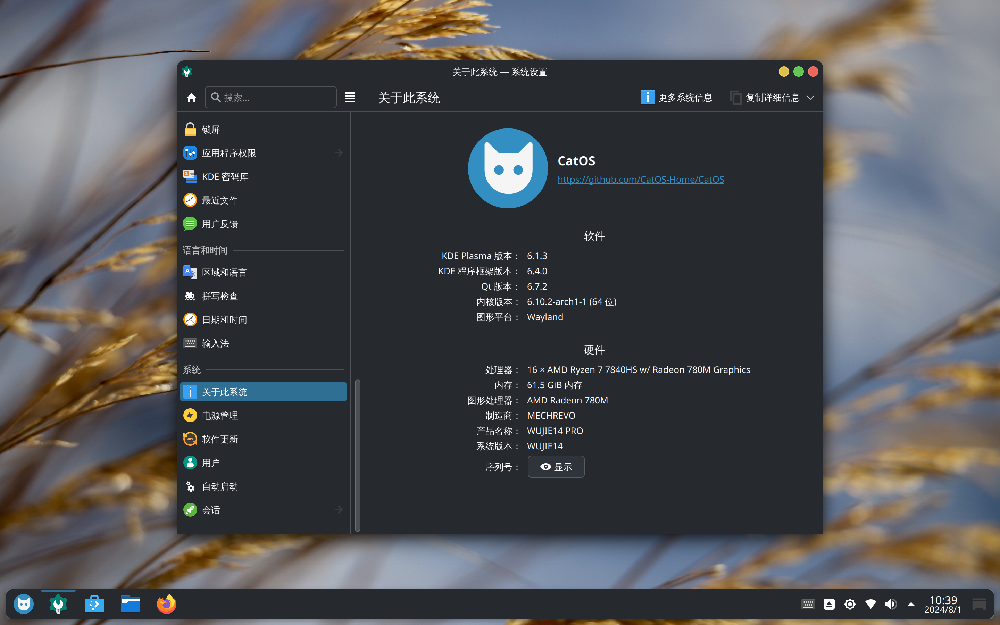

## 什么是发行版

Linux 只是一个内核，我们说 Linux 发行版的时候指的是将各种各样的软件和 Linux 内核打包好之后发行的操作系统。

因为源代码是公开的，并且使用的版权协议允许任何人自由进行修改、分发等操作，而不同开发者的理念、目的、偏好、发行策略不同，也就产生了各式各样的 Linux 发行版。

从 [Wikipedia List of Linux distributions](https://en.wikipedia.org/wiki/List_of_Linux_distributions) 页面可以看到一张特别长的发行版分支图。这其中最大，最值得重点提及的是 [Debian](https://www.debian.org/) 系发行版。即使是不熟悉 Linux 的人也可能听说过 Ubuntu（乌班图），它就是基于 Debian 制作的发行版。如果有一个软件要适配 Linux，那么它大概率会先出甚至只出 Debian 系的 `.deb` 后缀的软件包。虽然其他发行版通过一些额外操作也能装上 `.deb` 包，但是免不了要折腾，直接用 Debian 系发行版通常会更方便。

## 选择合适的发行版

  >~~好的教程敢于为读者做出选择~~

  [LinusTechTips的经历](https://www.bilibili.com/video/BV19Pw4zHEE8/?share_source=copy_web&vd_source=1c6a132d86487c8c4a29c7ff5cd8ac50)告诉我们："好的发行版选择至关重要"。通过 [Steam 硬件统计排名](https://store.steampowered.com/hwsurvey/Steam-Hardware-Software-Survey-Welcome-to-Steam?platform=linux) 选择发行版是我觉得最有效最贴合实际的策略。

  

  除去[基于 Arch 开发的 SteamOS](https://lists.archlinux.org/archives/list/arch-dev-public@lists.archlinux.org/thread/RIZSKIBDSLY4S5J2E2STNP5DH4XZGJMR/)，Arch Linux、Linux Mint 和 CachyOS 常居排行榜前三。
  >SteamOS 是专为游戏掌机和主机开发的系统，所以排除。

  如果你是第一次接触 Linux，[Linux Mint](https://linuxmint.com/) 就是最佳的入门之选，它是以新手友好为最大卖点的 Debian 系发行版，你将拥有最无痛的新手体验。
  
  >这还涉及到 Linux 显示协议的变迁。现在大部分桌面和发行版都已经转向新的 Wayland 协议，但是 Wayland 严格的权限管理加上软件厂商消极的适配开发，~~点名批评国产厂商~~，常常导致软件在 Wayland 上有各种问题，而 Linux Mint 仍将 X11 作为可选项，可以获得更稳定更完整的使用体验。

  如果想更进一步，获得最佳的桌面端 Linux 体验，[Arch Linux](https://archlinux.org/) 是最佳选择。

  >Arch 处在精简、易用和自由的平衡点。拥有最新的软件、最详尽的文档、最偏向桌面端日用的社区氛围，甚至还有 Steam 的背书。软件生态由社区用户提供的各种一键安装脚本扩充，虽然存在安全隐患，但是非常丰富，非常方便。

  Arch 的安装可能有些复杂，如果想要安装简单，开箱即用的 Arch Linux，以下是我推荐的 Arch 衍生发行版：

- [CachyOS](https://cachyos.org/)

  >极致性能。

  当前最热门的发行版。台式机的首选。缺点是稳定性低于原版 Arch Linux 且功耗略高，不适合注重续航的场景。

  

- [CatOS](https://www.catos.info/)

  >国产，适合中文用户。

  对中国大陆用户进行了专门调整的 Arch 衍生发行版。官网的 ISO 更新可能不及时，建议加 Q 群：`428382413`。

  

- [Garuda Linux](https://garudalinux.org/)

  >外观漂亮，快捷稳定。

  我个人最喜欢的 Arch 衍生发行版，主题设计很棒，还提供了很多便利工具，缺点是资源占用略高。

  

## 其他推荐的发行版

以下是值得尝试的发行版

- [Fedora](https://fedoraproject.org/)

  >你一定听说过 CentOS 吧

  永远处在 Linux 技术的最前沿，~~有人说这是当小白鼠~~。红帽是现代 Linux 技术生态的奠基者，Fedora 作为红帽系发行版的上游，如果以后想往这个方向发展职业的话一定要试试。

- [PikaOS Linux](https://wiki.pika-os.com/en/home)

  >Debian 系的“Arch”

  基于 Debian 开发分支的游戏发行版。Debian 常常因软件包老旧被诟病，而软件包很新的开发分支又不够稳定，PikaOS 很好地解决了这些问题。推荐给习惯 Debian 生态，同时又想要软件够新的人使用。

## 发行版避雷

  以下是我不建议当作桌面端日用的发行版。

- [Pop!_OS](https://system76.com/pop/)

  > 仍在测试

  因更换自研桌面导致各种问题，处于转型期，暂时不推荐日用。

- [Kali Linux](https://www.kali.org/)

  > 拒绝中二病

  面向网络安全的特殊发行版，其[官方文档](https://www.kali.org/docs/introduction/should-i-use-kali-linux/)明确指出不适合日用。同理，像 [BlackArch](https://blackarch.org/) 这样的发行版也不适合日用。

- [Debian](https://www.debian.org/)

  > 适合养老

  服务端的霸主，但是对于桌面端来说，它的软件包实在老旧。除非你要绝对的稳定性，否则不推荐使用。

- [Debian Sid](https://wiki.debian.org/DebianUnstable)

  > 面向开发者的测试分支

  有些人会推荐通过 Sid 分支兼顾新软件包和 Debian 生态，但[官方文档](https://wiki.debian.org/DebianUnstable)明确指出 Sid 不是滚动发行版本，也不保证拥有发行版的质量。如果你要用 Debian Sid，请使用 [PikaOS Linux](https://wiki.pika-os.com/)。

- [Deepin](https://www.deepin.org/index/zh)

  > 生态隔离

  对文字办公、影音娱乐来说开箱即用，但是与国际 Linux 生态隔离，需要额外费一番功夫才能正常使用。国产系统的通病。

第一节：[安装任意 Linux 系统前的准备工作](安装任意Linux系统的前期准备工作.md)
