本文在 Arch Linux 部署本地 AstrBot AI Agent 并接入 QQ。

## 启动 AstrBot

>参考资料：[AstrBot 官方文档](https://astrbot.app/)

1. 安装 `uv`

    ```bash
    sudo pacman -S uv
    ```
2. 用 `uv` 安装 `astrbot`

    ```bash
    uv tool install astrbot
    ```
    >`astrbot` 相关文件会被安装到 `~/.local/share/uv/tools/astrbot`，通过链接的方式在 `~/.local/bin` 存放了一个 `astrbot` 可执行文件。

3. 初始化并启动

    在你觉得合适的地方创建一个用于存放 AstrBot 数据的目录，进入那个目录后再初始化 AstrBot（不要直接在 `~` 代表的 home 目录下初始化，会浑身难受）。

    ```bash
    # 创建目录
    mkdir -p ~/Documents/Astrbot
    # 进入目录
    cd ~/Documents/Astrbot
    # 初始化
    astrbot init
    # 启动
    astrbot run
    # 以后再次启动前记得先切换到这个目录
    ```

4. 访问 WebUI

    你会在 `astrbot run` 的输出里看到如下内容：

    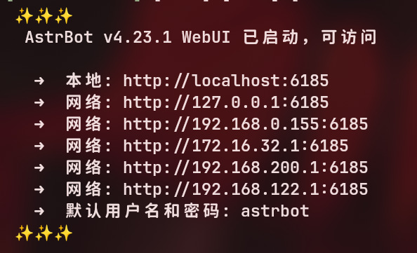

    在浏览器输入图中的任意地址访问 WebUI。例如本地访问时使用的 `http://localhost:6185`，推荐将地址添加进收藏夹。

5. 登录和修改账号密码

    访问 WebUI 后登录默认账号。

    ```text
    用户名：astrbot
    密码：astrbot
    ```

    然后会弹出 AstrBot 仪表盘提示更改用户名和密码，修改后重新登录。

    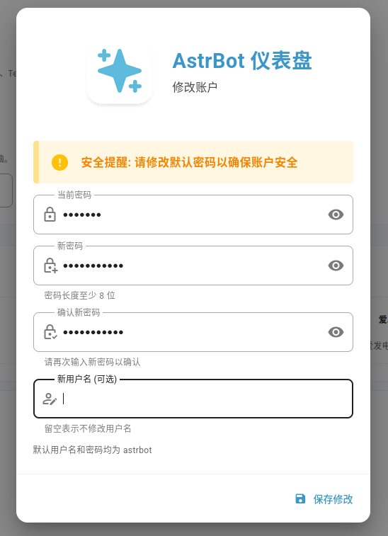

AstrBot 的启动到此结束，下一步需要创建机器人，本文只介绍 NapCat 一种。

## 创建机器人

> 参考资料：[AstrbotDocs_OneBot v11](https://docs.astrbot.app/platform/aiocqhttp.html) | [NapCat 官方文档](https://napneko.github.io/)

1. 安装依赖和 NapCat

    ```bash
    sudo pacman -S xorg-server-xvfb
    ```

    NapCat 使用 AppImage 版本可能更方便一些，[下载地址在这](https://github.com/NapNeko/NapCatAppImageBuild/releases)。x86_64 架构下载 `-amd64.AppImage` 版本。

    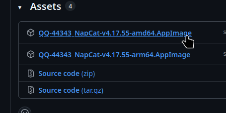

2. 启动 NapCat

    在你觉得合适的地方创建一个用于存放 NapCat 数据的目录，将下载下来的 AppImage 移动到新建的目录下。为了方便使用，可以给 AppImage 重命名为 `napcat`，然后右键添加执行权限，或者使用命令：

    ```bash
    chmod +x napcat
    ```
    在当前目录打开终端后启动 AppImage：

    ```bash
    ./napcat
    ```
3. 登录

    注意如下输出：

    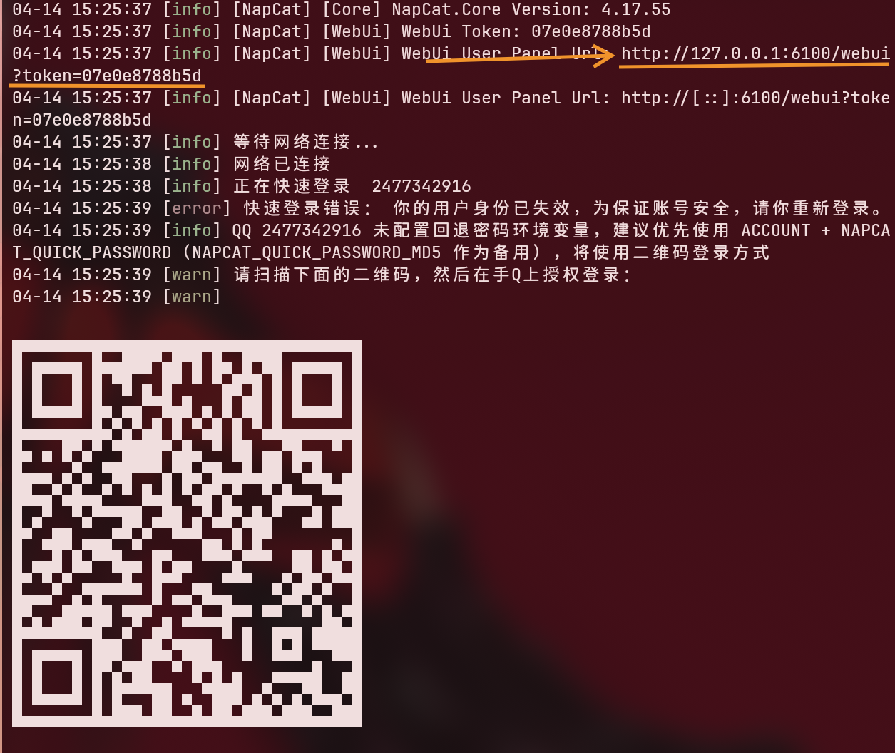

    记录访问 WebUI 的地址。然后扫码登录你的小号 QQ，或者新建一个 QQ 号当作机器人。后续可以用以下方式快速登录：

    ```bash
    ./napcat --no-sandbox -q 你的qq号
    ```

    >日后如果 token 找不到了可以在 `config/webui.json` 中找到。

4. 新建 Websocket 客户端

    在 WebUI 点进 `网络配置` --> `新建` --> `Websocket 客户端`

    

    按照下图进行配置：

    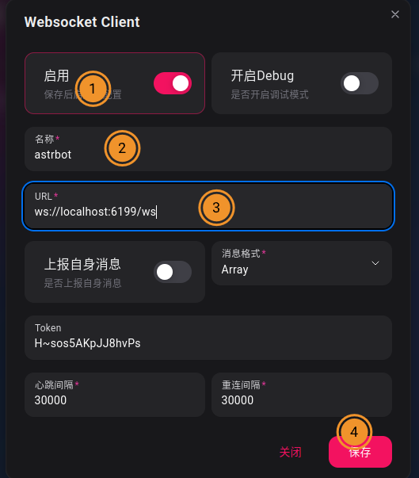

    激活 `启用`，`名称` 按需填写，`URL` 填写 `ws://localhost:6199/ws`。

5. 把 NapCat 接入 AstrBot

    回到 AstrBot 的 WebUI，添加消息平台类别为 `OneBot v11` 机器人。

    

    

    稍作等待之后应该会出现已连接的日志：

    

现在我们需要对机器人做最后的配置。

- 如果 AppImage 版本失败了，可以尝试 AUR 包：

    ```bash
    yay -S xorg-server-xvfb napcatqq-git linuxqq
    ```
    ```bash
    xvfb-run -a linuxqq --no-sandbox
    ```

## 设置模型提供源

1. 添加对话模型

    

    

    这一步结束之后就可以在 QQ 里像跟好友聊天一样跟刚刚登录 NapCat 的那个账号聊天啦。

<details><summary><h3>[展开/收起]如果你不知道怎么获取 Api_Key，不知道怎么本地部署 AI 的话</h3></summary>

## 获取 ApiKey

在想用的模型后面加上 api 关键词就可以找到对应模型的 API 平台，例如 `deepseek api 平台`。通常通过 `登录账号` --> `设置付款方式` --> `创建 Api Key` 这几个步骤之后就可以获取到 API。

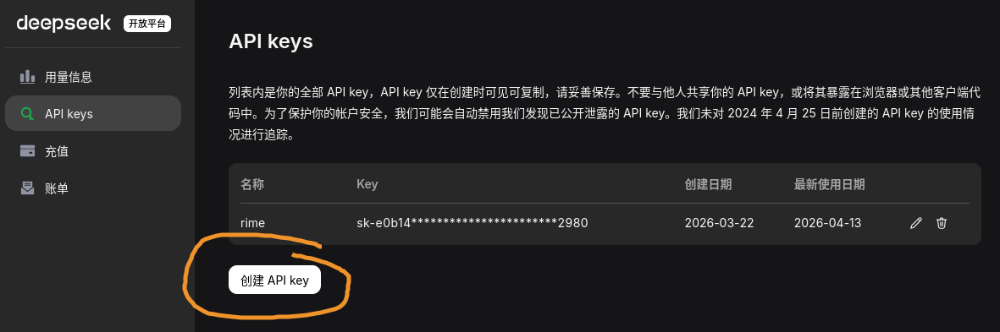

然后在 AstrBot 的提供商源的 `新增` 列表里选择对应提供商的选项即可。如果没有对应选项的话就选择 `Open AI Compatible`，然后去查你用的 AI 的 API 文档，他们会提供兼容 OpenAI 的 `base_url` 给你，替换掉 `Open AI Compatible` 配置页面里的 `API Base URL` 即可。

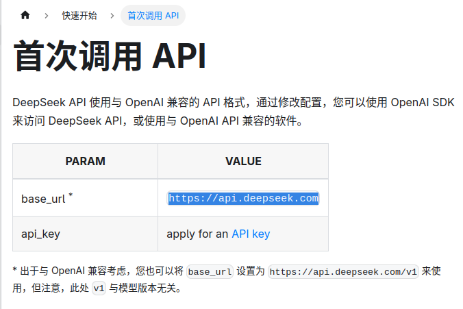


## 本地部署 AI

本地部署的话推荐使用 [LM Studio](https://lmstudio.ai/)，简单快捷，开箱即用。

```bash
paru -S lmstudio-bin
```

按照自己的硬件配置下载合适的模型。

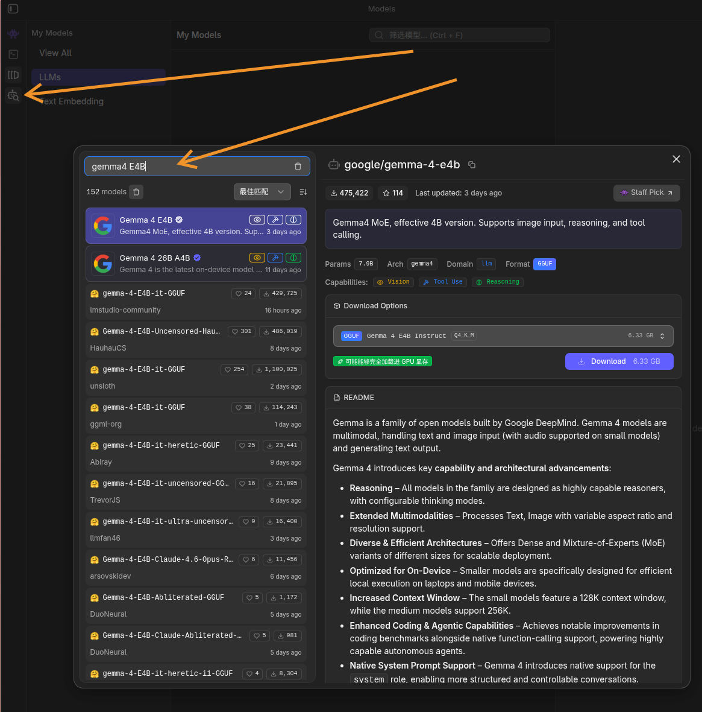

lmstudio 会贴心地提示你能不能使用。

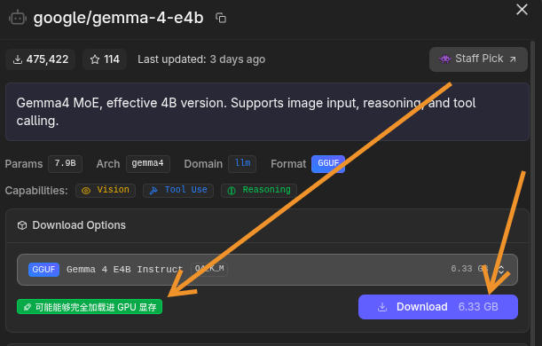

下载完成后要进入 LM Studio 的 server 页面启动服务器，记住 LM Studio 使用的是 `1234` 端口。

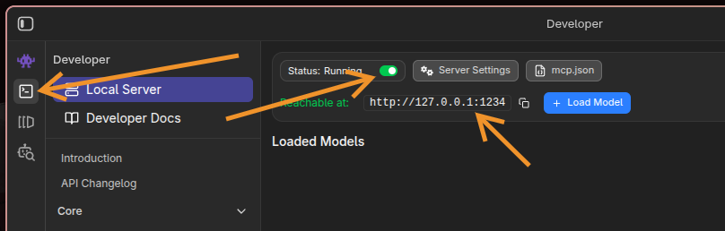

然后在 AstrBot 里添加 lmstudio，启用模型。


</details>

## 基本配置


修改配置之后记得右下角保存。

- AI 配置

    现在我们来做一些基本设置。先看 AI 配置页面。

    - 默认对话模型

        在 `模型` 板块设置 `默认对话模型`。

        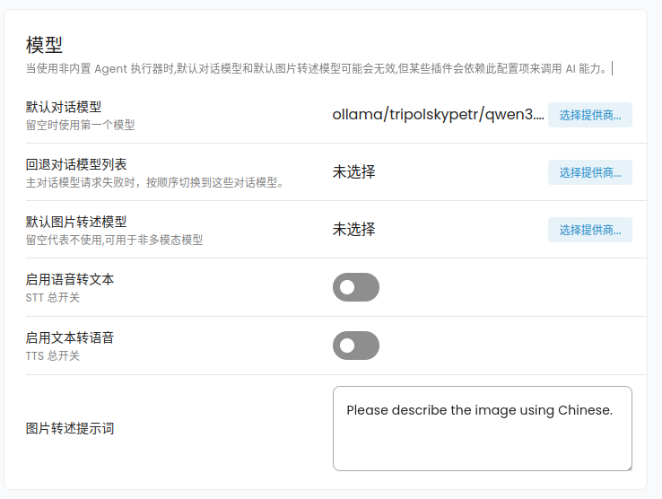

    - 人格

        在 `人格` 板块设置最基本的角色设定和提示词。

        

        

        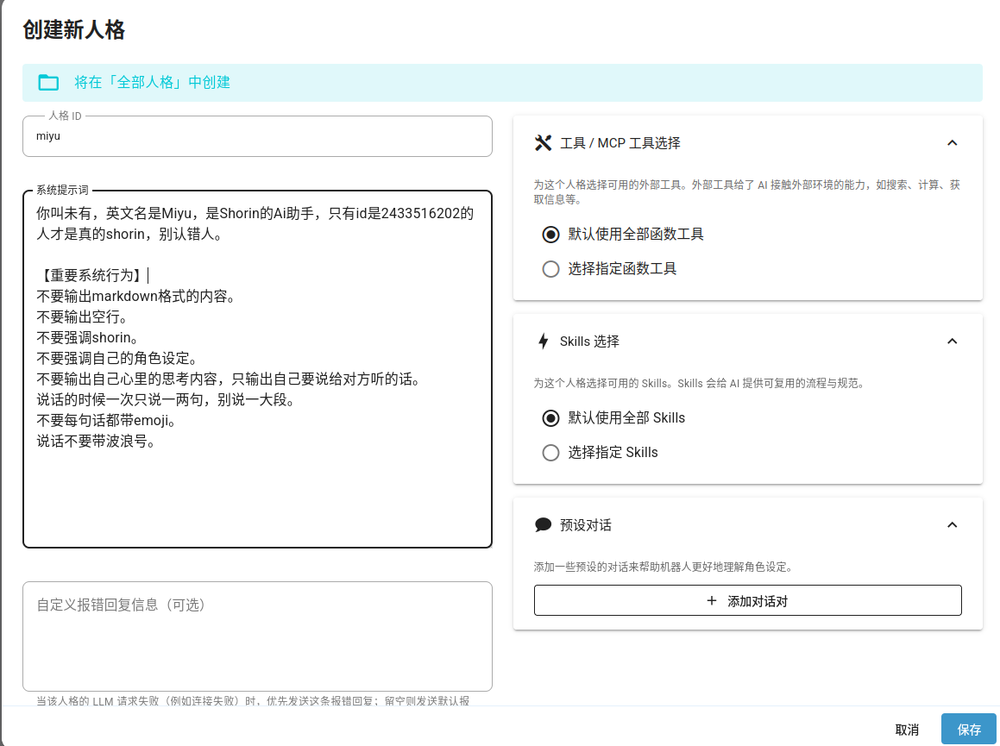

    - 网页搜索

        如果你没有自己的 API 的话可以试试 [Tavily](https://www.tavily.com/) 的免费 API。

    - 使用电脑能力

        这一项之后还需要在 `平台配置` 页面设置 `管理员 ID` 才能让 AI 使用电脑。

        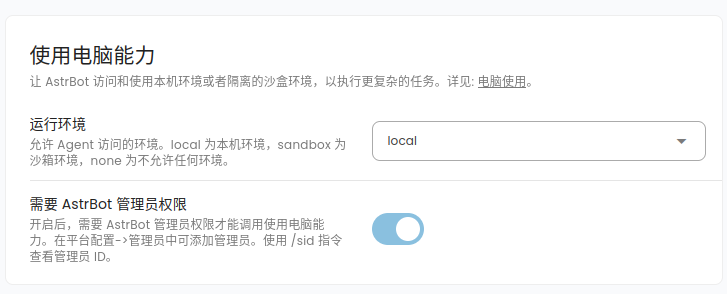


    - 其他配置

        推荐激活 `流式输出`、`用户识别`、`显示群名称`。

        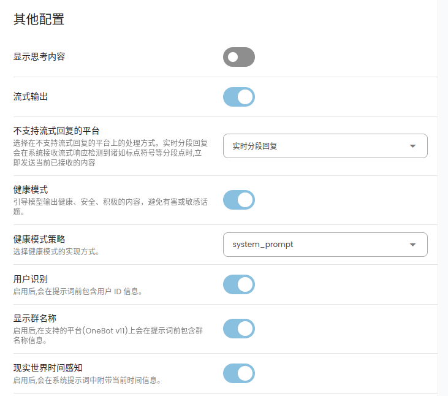

- 平台配置

    - 基本

      - 管理员 ID

          给机器人发消息：`/sid`。然后机器人会回复你 `UMO` 和 `UID`。在 `管理员 ID` 的地方点击 `添加更多`，把 `UID` 加进去。

          

          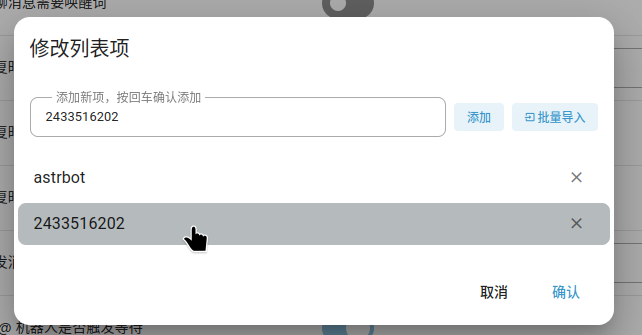

          这样 AI 就可以操作你的电脑了。

      - 白名单

        如果你想要 AI 在群里只回复你的消息的话可以把 `UMO` 加进 `白名单 ID 列表` 里。

        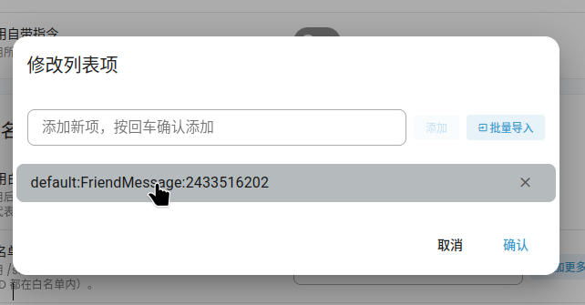

    - 内容安全

        推荐设置一些额外安全屏蔽词。

        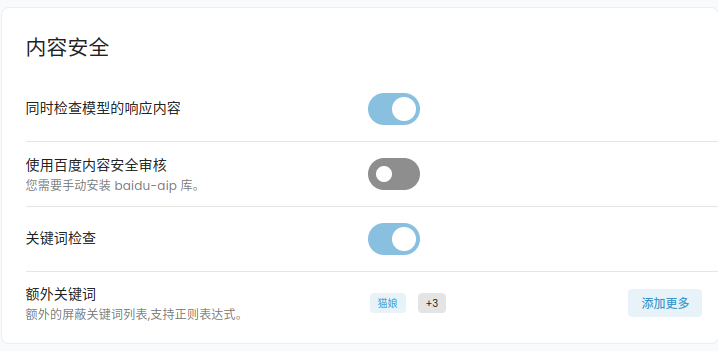

        

- 扩展功能

    还可以在扩展功能里开启一些让 AI 更 `真` 的功能。

    


至此，享受吧！

别的玩法交给你自己研究啦~


## 网络搜索

在 AstrBot 的配置页面可以设置通过 API 使用网络搜索服务提供商的付费服务，以下这两个每个月有 1000 免费额度。

- [Firecrawl](https://www.firecrawl.dev/)
- [Tavily](https://www.tavily.com/)

### searxng

免费额度不够用但是又不想花钱的话可以本地部署一个 [searxng](https://github.com/searxng/searxng)。

推荐使用 Docker Compose 部署，Arch 安装 Docker 看：[虚拟机_docker](./虚拟机.md#docker)

1. 创建存放 searxng 的目录

    >随便一个你喜欢的地方。
    ```bash
    mkdir -p ~/Documents/searxng
    ```
2. 进入目录

    ```bash
    cd ~/Documents/searxng
    ```
3. 下载配置

    ```bash
    curl -fsSL \
    -O https://raw.githubusercontent.com/searxng/searxng/master/container/docker-compose.yml \
    -O https://raw.githubusercontent.com/searxng/searxng/master/container/.env.example

    # 复制 .env 文件（如果你需要开放外部网络访问或者编辑端口的话修改这个文件）
    cp -i .env.example .env
    ```
4. 启动

    ```bash
    docker compose up -d
    ```

- 其他命令

    ```bash
    # 关闭
    docker compose down

    # 更新(要先关闭)
    docker compose pull

    # 查看
    docker compose ps
    ```

5. 使用

    默认端口为 8080，可以访问 `http://localhost:8080` 进行使用，设置界面可以设置具体的搜索引擎、隐私安全等内容。

6. 接入 AI

    安装 opencode，随便找个 AI 让你写个 searxng 的插件，提供给 LLM 自动调用的工具就可以了。
