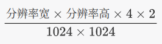

目录

- [嵌套虚拟化](KVM虚拟机.md#嵌套虚拟化)
- [桥接网络](KVM虚拟机.md#配置桥接网络)
- [Win11 虚拟机](KVM虚拟机.md#安装-win11-虚拟机)
    - [文件共享](KVM虚拟机.md#文件分享)
- [远程桌面](KVM虚拟机.md#远程桌面)
    - [Parsec](KVM虚拟机.md#parsec)
    - [Sunshine+Moonlight](KVM虚拟机.md#sunshinemoonlight)
- [显卡直通](KVM虚拟机.md#显卡直通)
    - [Looking Glass](KVM虚拟机.md#looking-glass)

# KVM/QEMU 虚拟机

1. 安装 QEMU，图形界面，TPM，网络组件

   ```bash
   sudo pacman -S qemu-full virt-manager swtpm dnsmasq
   ```

2. 开启 libvirtd 系统服务

   ```bash
   sudo systemctl enable --now libvirtd
   ```

3. 开启 NAT default 网络

   ```bash
   sudo virsh net-start default
   sudo virsh net-autostart default
   ```

4. 添加组权限 需要登出

   ```bash
   sudo usermod -a -G libvirt $(whoami)
   ```

5. 启动 virt-manager 虚拟机管理程序

有一个注意点，virt-manager 默认的连接是系统范围的，如果需要用户范围的话需要左上角新增一个用户会话连接。

## 嵌套虚拟化

Intel 的话用 kvm_intel

- 临时生效

```bash
modprobe kvm_amd nested=1
```

- 永久生效

  1. 编辑配置文件

  ```bash
  sudo vim /etc/modprobe.d/kvm_amd.conf
  ```

  写入

  ```bash
  options kvm_amd nested=1
  ```

  2. 重新生成 initramfs

  ```bash
  sudo mkinitcpio -P
  ```

  3. 重启电脑

## 配置桥接网络

无线网卡无法配置桥接。

1. 启动高级网络配置工具（KDE 进设置里的 WiFi 和网络）

2. 运行：

   ```bash
   nm-connection-editor
   ```

3. 添加虚拟网桥，接口填 bridge0

4. 添加网桥连接，选择以太网，选择网络设备

5. 保存后将网络连接改为刚才创建的以太网网桥连接

## 安装 Win11 虚拟机

> [手把手教你给笔记本重装系统（Windows篇）_哔哩哔哩_bilibili](https://www.bilibili.com/video/BV16h4y1B7md/?spm_id_from=333.337.search-card.all.click)

1. 任选一个网站下载镜像

   - [HelloWindows.cn - 精校 完整 极致 Windows系统下载仓储站](https://hellowindows.cn/)

   - [下载 Windows 11](https://www.microsoft.com/zh-cn/software-download/windows11)

   - 可选：Win11 IoT LTS 镜像

     ```text
     https://go.microsoft.com/fwlink/?linkid=2270353&clcid=0x409&culture=en-us&country=us
     ```

2. 下载 VirtIO 驱动镜像

   [Index of /groups/virt/virtio-win/direct-downloads/archive-virtio](https://fedorapeople.org/groups/virt/virtio-win/direct-downloads/archive-virtio/?C=M;O=A)

   点击 last modified，然后下载最新版本

3. [「Archlinux究极指南」从手动安装到显卡直通](https://www.bilibili.com/video/BV1L2gxzVEgs/?spm_id_from=333.1387.homepage.video_card.click&vd_source=65a8f230813d56660e48ae1afdfa4182)按照视频里 KVM 虚拟机的部分安装。或者参照这篇教程[winapps/docs/libvirt.md at main · winapps-org/winapps](https://github.com/winapps-org/winapps/blob/main/docs/libvirt.md)

### 跳过联网

确保机器**没有连接到网络**，按下 Shift+F10，鼠标点击选中弹出来的 CMD 窗口，运行：

```batch
oobe\bypassnro
```

### 文件分享

主要有 SMB 和 VirtIO-FS 两种，VirtIO-FS 的性能更好，但是因为是本机传输，所以 SMB 也不差。

- VirtIO-FS

   [如何在 Linux 主机和 KVM 中的 Windows 客户机之间共享文件夹 | Linux 中国 - 知乎](https://zhuanlan.zhihu.com/p/645234144)

   1. 确认开启共享内存
   2. 打开文件管理器，复制要共享的文件夹的路径
   3. 在虚拟机管理器内添加共享文件夹，粘贴刚才复制的路径，取个名字
   4. Win11 虚拟机内安装 WinFSP
      https://winfsp.dev/rel/
   5. 搜索 service（服务），启用 VirtIO-FS Service，设置为自动

- SMB

   1. 安装 Samba

      ```bash
      sudo pacman -S samba 
      ```
   2. 新建共享配置

      ```bash
      sudo vim /etc/samba/smb.conf
      ```
      ```ini
      [global]
      workgroup = WORKGROUP
      server string = MyArch
      security = user
      map to guest = bad user
      # 优化虚拟机访问性能
      socket options = TCP_NODELAY IPTOS_LOWDELAY SO_RCVBUF=131072 SO_SNDBUF=131072
      
      [Share]
      path = /你的/arch/共享文件夹路径
      valid users = 你的用户名
      read only = no
      browsable = yes
      ```
   3. 设置 SMB 密码

      `shorin` 替换为你的用户名
      ```bash
      sudo smbpasswd -a shorin
      ```

   4. 启用服务

      ```bash
      systemctl enable --now smb nmb
      ```
   
   5. 在虚拟机里确认虚拟机网关地址

      CMD 运行 `ipconfig` 命令，一般是 `192.168.122.1`

   6. 在虚拟机里连接 SMB

      打开 Win 的文档管理器，在地址栏输入 `\\192.168.122.1`，回车后会弹出密码框。

## 远程桌面

### Parsec

1. Win 虚拟机上浏览器搜索安装

2. Linux 上安装

   ```bash
   yay -S parsec-bin
   ```

3. 两个系统都开启，登录相同账号


### Sunshine+Moonlight

> [GitHub - LizardByte/Sunshine: Self-hosted game stream host for Moonlight.](https://github.com/LizardByte/Sunshine)

1. 虚拟机 Win11 内安装 Sunshine

   https://github.com/LizardByte/Sunshine

   启动后右下角托盘右键 Sunshine 的图标打开 Web 网页，设置账号密码并登录。

2. 虚拟机内安装虚拟显示器

   https://github.com/VirtualDrivers/Virtual-Display-Driver

3. Linux 安装 Moonlight

   ```bash
   sudo pacman -S moonlight-qt
   ```

4. Linux 启动 Moonlight 后会搜索到 Win11 内的 Sunshine，点击连接会出现 PIN 码，在 Win11 的 Sunshine Web 页面设置 PIN 码添加设备就可以了。

## 显卡直通

分为冷切换和[热切换](#热切换)两种。需要有两个显卡。
>显卡直通完毕之后需要删除原本的 VirtIO、QXL 之类的显卡，然后配置任意远程桌面。

在开始配置之前，要确认开启 IOMMU（命令有输出说明开启）：

```bash
sudo dmesg | grep -e DMAR -e IOMMU
```

现代设备通常都支持 IOMMU 且默认开启，BIOS 里的选项通常为 `Intel VT-d`、`AMD-V` 或者 `IOMMU`。如果没有的话搜索一下自己的 CPU 和主板型号看看是否支持。


### 冷切换

> [PCI passthrough via OVMF - ArchWiki](https://wiki.archlinux.org/title/PCI_passthrough_via_OVMF)


1. 获取显卡的硬件 ID，显卡所在 group 的所有设备的 ID 都记下

   ```bash
   for d in /sys/kernel/iommu_groups/*/devices/*; do 
       n=${d#*/iommu_groups/*}; n=${n%%/*}
       printf 'IOMMU Group %s ' "$n"
       lspci -nns "${d##*/}"
   done
   ```

2. 隔离 GPU

   ```bash
   sudo vim /etc/modprobe.d/vfio.conf
   ```

   写入

   ```bash
   options vfio-pci ids=10de:28e0,10de:22be （硬件ID与硬件ID之间用英文逗号隔开）
   ```

3. 编辑内核参数让 VFIO-PCI 抢先加载

   1. ```bash
      sudo vim /etc/mkinitcpio.conf
      ```

   2. `MODULES=（）` 里面写入 `vfio_pci vfio vfio_iommu_type1`

      ```bash
      MODULES=(... vfio_pci vfio vfio_iommu_type1  ...)
      ```

      `HOOKS=()` 里面确认有 `modconf`

      ```bash
      HOOKS=(... modconf ...)
      ```

4. 重新生成 initramfs

   ```bash
   sudo mkinitcpio -P
   ```

5. 安装和配置 OVMF

   ```bash
   sudo pacman -S --needed edk2-ovmf
   ```

   编辑配置文件

   ```bash
   sudo vim /etc/libvirt/qemu.conf
   ```

   搜索 nvram，在合适的地方写入：

   ```text
   nvram = [
   	"/usr/share/ovmf/x64/OVMF_CODE.fd:/usr/share/ovmf/x64/OVMF_VARS.fd"
   ]
   ```

6. 重启电脑

   记得把显示器插到核显输出的口上。

7. virt-manager 的虚拟机页面内添加设备

   PCI Host Device 里找到要直通的显卡（只直通显卡，不要直通类似 audio 的东西，可能会 43 报错，安装完驱动之后再直通 audio），然后 USB Host Device 里面把鼠标键盘也直通进去。

8. 开启 Win11 虚拟机，下载 NVIDIA App 安装驱动

9. 关闭虚拟机，虚拟机设置里显卡改成 None

#### 取消冷切换显卡直通

1. ```bash
   sudo vim /etc/modprobe.d/vfio.conf
   ```

   注释掉里面的东西

2. 重新生成 initramfs

   ```bash
   sudo mkinitcpio -P
   ```

3. ```bash
   reboot
   ```

### 热切换

热切换属进阶内容，看：[ShorinWiki_热切换显卡直通](热切换显卡直通.md)

## Looking Glass

> 参考：[Installation — Looking Glass B7 documentation](https://looking-glass.io/docs/B7/install/) | [PCI passthrough via OVMF - ArchWiki](https://wiki.archlinux.org/title/PCI_passthrough_via_OVMF)

Looking Glass 通过共享内存实现屏幕分享，专为显卡直通虚拟机设计。Win 虚拟机内需要安装虚拟显示器：[Virtual-Display-Driver](https://github.com/VirtualDrivers/Virtual-Display-Driver)

1. `groups` 命令确认自己在 KVM 组

   不在的话添加，注销才能生效

   ```bash
   sudo gpasswd -a $USER kvm 
   ```

2. 计算需要的内存大小
   
   
   
   计算结果以2的n次幂向上取整。
   
3. 共享内存配置

   分 KVMFR 内核模块和标准共享内存两种方式。

   - 方法一：KVMFR（推荐）
   
     > 参考：[IVSHMEM with the KVMFR module ](https://looking-glass.io/docs/B7/ivshmem_kvmfr/)
   
     KVMFR 内核模块方式的 Looking Glass 性能更好，但是不能用 VirtIO-FS 进行文件共享，需要使用 SMB，这个取舍是值得的。
   
     1. 安装模块
   
        请确保已经安装了你使用的内核的头文件。
   
        ```bash
        yay -S --needed linux-headers looking-glass-module-dkms-git
        ```
   
     2. 加载模块并配置权限
   
        ```bash
        sudo vim /etc/modprobe.d/kvmfr.conf
        ```
   
        > 把此处的 `128` 改成你实际需要的大小
   
        ```text
        options kvmfr static_size_mb=128
        ```
   
        用 systemd 加载：
   
        ```bash
        sudo vim /etc/modules-load.d/kvmfr.conf
        ```
   
        ```text
        # KVMFR Looking Glass module
        kvmfr
        ```
   
        设置权限：
   
        ```bash
        sudo vim /etc/udev/rules.d/99-kvmfr.rules
        ```
   
        ```text
        SUBSYSTEM=="kvmfr", OWNER="shorin", GROUP="kvm", MODE="0660"
        ```
   
        > 记得把 `shorin` 改成你的用户名
   
        然后编辑 QEMU 的 cgroup 设备权限：
   
        ```bash
        sudo vim /etc/libvirt/qemu.conf
        ```

        搜索 `cgroup_device_acl`，取消注释后加上 `/dev/kvmfr0`，注意逗号。
   
        ```text
        cgroup_device_acl =[
            "/dev/null", "/dev/full", "/dev/zero",
            "/dev/random", "/dev/urandom",
            "/dev/ptmx", "/dev/kvm", "/dev/kqemu",
            "/dev/rtc","/dev/hpet", "/dev/vfio/vfio",
            "/dev/kvmfr0"
        ]
        ```
   
        - 可选：配置 AppArmor 权限
   
            如果你使用了 AppArmor 的话
            
            ```bash
            sudo vim /etc/apparmor.d/local/abstractions/libvirt-qemu
            ```
            
            ```text
            # Looking Glass
            /dev/kvmfr0 rw,
            ```
            
            
   
     3. 重启电脑
   
        重启后 `sudo dmesg | grep kvmfr` 应该能看到 `kvmfr: creating 1 static devices`。
   
        用 `ls -l /dev/kvmfr0` 应该可以看到文件权限是 `shorin kvm`
   
   - 方法二：shmem 标准共享内存（配置了 KVMFR 的跳过这一节）
   
     > 参考：[IVSHMEM with standard shared memory](https://looking-glass.io/docs/B7/ivshmem_shm/)
   
     如果你一定要用 VirtIO-FS，可以通过 shmem 配置 Looking Glass
   
     1. 设置共享内存设备对应的文件的规则
     
         ```bash
         sudo vim /etc/tmpfiles.d/10-looking-glass.conf
         ```
   
     	写入（`shorin` 改为自己的用户名）：
     
         ```text
         f /dev/shm/looking-glass 0660 shorin kvm -
         ```
   
         >`f` 代表文件规则
   
         >`/dev/shm/looking-glass` 是共享内存文件的路径
   
         >`0660` 设置所有者和所属组的读写权限
   
         >`shorin` 设置所有者
   
         >`kvm` 设置所属组
   
         >`-` 代表保留时间永久，不进行清理
     
     2. 无须重启，现在手动创建文件
     
        ```bash
        sudo systemd-tmpfiles --create /etc/tmpfiles.d/10-looking-glass.conf
        ```

4. 虚拟机配置

   打开 virt-manager，点击编辑 > 首选项，勾选启用 XML 编辑。现在要把刚刚创建的共享内存加进虚拟机，并配置鼠标键盘音频剪贴板同步什么的。

   1. 添加设备

      - 如果使用 KVMFR 的话

        XML 最顶部应该有一行 `<domain type='kvm'>` 加上 namespace

        ```xml
        <domain type='kvm' xmlns:qemu='http://libvirt.org/schemas/domain/qemu/1.0'>
        ```

        然后在最底部 `</domain>` 上面一行插入

        ```xml
        <qemu:commandline>
          <qemu:arg value="-device"/>
          <qemu:arg value="{'driver':'ivshmem-plain','id':'shmem0','memdev':'looking-glass'}"/>
          <qemu:arg value="-object"/>
          <qemu:arg value="{'qom-type':'memory-backend-file','id':'looking-glass','mem-path':'/dev/kvmfr0','size':134217728,'share':true}"/>
        </qemu:commandline>
        ```

        > 把 `'size':134217728` 的数值改成你实际的数值，计算方法是：`你之前计算出来的内存（MB）*1024*1024`。

      - 如果使用 shmem 的话

        找到 XML 底部的 `</devices>`，在 `</devices>` 的上面一行添加，size 记得改成自己需要的，就像这样：

        ```xml
        <devices>
            ...
          <shmem name='looking-glass'>
            <model type='ivshmem-plain'/>
            <size unit='M'>64</size> 
          </shmem>
        </devices>
        ```
       
   2. 设置 SPICE 协议
   
       确认有 SPICE 显示协议，显卡设置为 None
   
      1. 键鼠传输
   
         添加 VirtIO 键盘和 VirtIO 鼠标（要在 XML 里面更改 `bus="ps2"` 为 `bus="virtio"`）
   
      2. 剪贴板同步
   
         确认有信道 (SPICE)，没有的话添加，设备类型为 SPICE
   
      3. 声音传输
   
         确认有声卡 ich9，点击概况，去到 XML 底部，在里面找到下面这段，确认 `type` 为 `spice`
   
         ```xml
         <audio id='1' type='spice'/>
         ```
   
5. 安装 Looking Glass 服务端

   [Looking Glass - Download Looking Glass](https://looking-glass.io/downloads)

   浏览器搜索 Looking Glass，点击 Download，下载 Bleeding-Edge 的 Windows Host Binary，解压后双击 exe 安装

6. Linux 安装客户端

   服务端和客户端的版本要匹配，最容易出错的就是这个地方。Bleeding-Edge 对应 `-git` 包

   ```bash
   yay -S looking-glass-git
   ```

7. Linux 打开 Looking Glass 即可连接

8. 关闭虚拟机。克隆虚拟机之后使用克隆机而不是初号机，避免日后需要重新配置

#### 使用技巧

具体可以看这个页面：https://looking-glass.io/docs/B6-rc1/usage/

开启 Looking Glass 后使用 Scroll Lock 键有很多功能，包括最重要的键鼠捕获。长按会显示可用功能的列表。如果你的键盘没有 Scroll Lock 键，可以修改配置文件更改。

```bash
 vim ~/.config/looking-glass/client.ini
```

 写入： 

 ```ini
[input]
escapeKey=KEY_F9
 ```

把 F9 换成自己想要的键，可用的键可以在终端输入 looking-glass-client -m KEY 查看

我是用桌面环境的快捷键切换全屏和窗口的，你也可以选择设置以全屏模式开启，还是刚才那个配置文件，写入：

```ini
[win]
fullScreen = yes 
```

## KVM 虚拟机性能优化和伪装

优化后可以做到原生九成五的性能。

### 禁用 memballoon

> [libvirt/QEMU Installation — Looking Glass B7 documentation](https://looking-glass.io/docs/B7/install_libvirt/#memballoon)

memballoon 的目的是提高内存的利用率，但是由于它会不停地"取走"和"归还"虚拟机内存，导致显卡直通时虚拟机内存性能极差。

将虚拟机 XML 里面的 memballoon 改为 none，这将显著提高 low 帧。

```xml
<memballoon model="none"/>
```

### 内存大页

> [KVM - Arch Linux 中文维基](https://wiki.archlinuxcn.org/wiki/KVM#%E5%BC%80%E5%90%AF%E5%86%85%E5%AD%98%E5%A4%A7%E9%A1%B5)

可以大幅提高内存性能。用 Minecraft 实测帧数提升了 20%。注意，设置大页的那部分内存本机无法使用。

内存大页默认是 2MB，如果你内存够大的话可以试试 1GB 大页

#### 2MB

1. 计算大页大小

   内存（GB）* 1024 / 2 = 需要的大小

   比如 16GB 内存就是 16*1024/2=8192，wiki 建议略大一些，那就 8200。

   我通常给虚拟机分 24GB 内存，24*1024/2=12288，略大一些就是 12300。

2. 编辑虚拟机 XML

   在 virt-manager 的首选项里开启 XML 编辑，找到 `<memoryBacking>` 并添加 `<hugepages/>`

   ```xml
     <memoryBacking>
       <hugepages/>
     </memoryBacking>
   ```

3. 永久生效

   记得把数字改成自己需要的

   ```bash
   sudo vim /etc/sysctl.d/40-hugepage.conf
   ```

   ```text
   vm.nr_hugepages = 8800
   ```

4. reboot

5. 虚拟机开启后查看大页使用情况

   ```bash
   grep HugePages /proc/meminfo
   ```

- 取消大页

   ```bash
   sudo rm /etc/sysctl.d/40-hugepage.conf
   ```

   ```bash
   reboot
   ```

#### 1GB

1. 编辑启动参数

   ```bash
   sudo vim /etc/default/grub
   ```
   在内核参数（就是 `loglevel=5` 的地方）写：

   ```text
   default_hugepagesz=1G hugepagesz=1G hugepages=16
   ```
   此处的 16 是你实际要使用的大页数量

   编辑 `/etc/default/grub` 后记得更新 `grub.cfg`

   ```bash
   sudo grub-mkconfig -o /boot/grub/grub.cfg
   ```
2. 编辑虚拟机 XML

   ```xml
   <memoryBacking>
      <hugepages>
         <page size='1048576' unit='KiB'/>
      </hugepages>
   </memoryBacking>
   ```

这样就可以了。

- 查看大页使用情况：

   ```bash
   # 查看成功分配到了多少个 1GB 大页
   cat /sys/kernel/mm/hugepages/hugepages-1048576kB/nr_hugepages
   
   # 查看有多少个正在被虚拟机使用
   cat /sys/kernel/mm/hugepages/hugepages-1048576kB/resv_hugepages
   ```

### CPU Pinning

>这部分可能有些复杂，不明白的话可以装个本地的 agent，比如 opencode，让 AI 帮你配置。

[PCI passthrough via OVMF - ArchWiki](https://wiki.archlinux.org/title/PCI_passthrough_via_OVMF#CPU_pinning)

主要目的是提升 CPU 缓存性能。避免虚拟机 CPU 线程对应的物理 CPU 线程变化导致缓存性能下降。

通常在 virt-manager 里手动设置 CPU 拓扑为 1 插槽，核心数和线程数跟自己的 CPU 对应就够用了，如果要极致的优化继续往下看。

1. 查看物理 CPU 拓扑

   ```bash
   lscpu -e
   ```

   主要看 3 项，CPU 是线程，CORE 是物理核心，L1d:L1i:L2:L3 是缓存。如果开启了超线程，会出现一个 CORE 对应两个 CPU 的情况。究竟该 pin 哪些 CPU 需要看缓存。

   看一个例子：

   ```text
     CPU    NODE     SOCKET    CORE L1d:L1i:L2:L3 ONLINE    MAXMHZ   MINMHZ       MHZ
     0    0      0    0 0:0:0:0           是 5263.0610 402.7860 4687.7769
     1    0      0    1 1:1:1:0           是 5263.0610 402.7860 4687.6860
     2    0      0    2 2:2:2:0           是 5263.0610 402.7860 4688.5659
     3    0      0    3 3:3:3:0           是 5263.0610 402.7860 4688.6870
     4    0      0    4 4:4:4:0           是 5263.0610 402.7860 4688.7310
     5    0      0    5 5:5:5:0           是 5263.0610 402.7860 4689.5552
     6    0      0    6 6:6:6:0           是 5263.0610 402.7860 4689.2202
     7    0      0    7 7:7:7:0           是 5263.0610 402.7860 4689.5889
     8    0      0    0 0:0:0:0           是 5263.0610 402.7860 4688.2788
     9    0      0    1 1:1:1:0           是 5263.0610 402.7860 2361.5911
     10    0      0    2 2:2:2:0           是 5263.0610 402.7860 4688.4370
     11    0      0    3 3:3:3:0           是 5263.0610 402.7860 4688.4502
     12    0      0    4 4:4:4:0           是 5263.0610 402.7860 4688.4072
     13    0      0    5 5:5:5:0           是 5263.0610 402.7860 4688.2578
     14    0      0    6 6:6:6:0           是 5263.0610 402.7860 4688.2778
     15    0      0    7 7:7:7:0           是 5263.0610 402.7860 4688.3350
   ```

   这个例子里所有核心共享 L3 缓存，所以无法优化 L3 缓存性能。但是可以优化 L1 和 L2。比如 CORE0 对应 CPU0 和 CPU8，CPU0 和 CPU8 共享同一个 L1/L2 缓存，如果仅 pin CPU0 就会导致运行到 CPU8 的缓存里，导致缓存性能下降，所以必须同时 pin CPU0 和 CPU8

2. 修改 XML，在 `<vcpu placement="static">16</vcpu>` 下方插入

   ```xml
     <iothreads>2</iothreads>
     <cputune>
       <vcpupin vcpu="0" cpuset="2"/>
       <vcpupin vcpu="1" cpuset="10"/>
       <vcpupin vcpu="2" cpuset="3"/>
       <vcpupin vcpu="3" cpuset="11"/>
       <vcpupin vcpu="4" cpuset="4"/>
       <vcpupin vcpu="5" cpuset="12"/>
       <vcpupin vcpu="6" cpuset="5"/>
       <vcpupin vcpu="7" cpuset="13"/>
       <vcpupin vcpu="8" cpuset="6"/>
       <vcpupin vcpu="9" cpuset="14"/>
       <vcpupin vcpu="10" cpuset="7"/>
       <vcpupin vcpu="11" cpuset="15"/>
       <emulatorpin cpuset="0,8,1,9"/>
       <iothreadpin iothread="1" cpuset="0,8,1,9"/>
       <iothreadpin iothread="2" cpuset="0,8,1,9"/>
     </cputune>
   ```

     `<iothreads>2</iothreads>` 设置 IO 线程

   `<vcpupin vcpu="0" cpuset="2"/>` 虚拟机有几个线程就写几行 vcpu，0 算第一个。cpuset 指定 vcpu 对应的主机 CPU 线程，也就是 `lscpu -e` 输出结果里的 CPU 那一列。比如举例的这段的意思是 vcpu0 对应本机的 CPU2

   `<emulatorpin cpuset="0,1,8,9"/>` 这一段设置专门用来处理虚拟机相关工作的 CPU。

   `<iothreadpin iothread="1" cpuset="0,1,8,9"/>` 指定专门用来做 IO 相关工作的 CPU。    

3. 禁用大部分 timer，以减少虚拟机空闲时的 CPU 占用

   ```xml
   <clock offset='localtime'>
     <timer name='rtc' present='no' tickpolicy='catchup'/>
     <timer name='pit' present='no' tickpolicy='delay'/>
     <timer name='hpet' present='no'/>
     <timer name='kvmclock' present='no'/>
     <timer name='hypervclock' present='yes'/>
   </clock>
   ```

4. 启用 Hyper-V Enlightenments

   ```xml
   <hyperv>
   <relaxed state='on'/>
   <vapic state='on'/>
   <spinlocks state='on' retries='8191'/>
   <vpindex state='on'/>
   <synic state='on'/>
   <stimer state='on'>
   <direct state='on'/>
   </stimer>
   <reset state='on'/>
   <frequencies state='on'/>
   <reenlightenment state='on'/>
   <tlbflush state='on'/>
   <ipi state='on'/>
   </hyperv> 
   ```

   让 KVM "伪装"成 Hyper-V，以"欺骗" Windows 开启高性能模式，大幅提升 Windows 虚拟机的运行性能、降低 CPU 消耗，并改善其稳定性

### 伪装虚拟机

这部分内容也许过时了。

[How to play PUBG (with BattleEye) on a Windows VM : r/VFIO](https://www.reddit.com/r/VFIO/comments/18p8hkf/how_to_play_pubg_with_battleeye_on_a_windows_vm/)

为了避免被反作弊程序检测到虚拟机，需要修改 XML 伪装虚拟机。

#### ⚠️警告：进入虚拟机的反作弊之间的猫鼠游戏意味着你做好了被封号的觉悟 

#### ⚠️警告：每进行一步都要确认虚拟机能正常运行再进行下一步

1. 可选：使用 SATA 硬盘和 e1000 网卡

2. 在 `</hyperv>` 下面一行插入：

   ```xml
   <kvm>
   <hidden state="on"/>
   </kvm> 
   ```

3. 在 `<os firmware="efi">` 上面一行插入，这是伪装 BIOS。然后复制 XML 顶部的 UUID，替换下面这段里的【这里要粘贴自己虚拟机的 UUID】。里面的 name 信息可以按需修改。

   ```xml
   <sysinfo type="smbios">
   <bios>
   <entry name="vendor">American Megatrends International, LLC.</entry>
   <entry name="version">F21</entry>
   <entry name="date">10/01/2024</entry>
   </bios>
   <system>
   <entry name="manufacturer">Gigabyte Technology Co., Ltd.</entry>
   <entry name="product">X670E AORUS MASTER</entry>
   <entry name="version">1.0</entry>
   <entry name="serial">12345678</entry>
   <entry name="uuid">【这里要粘贴自己虚拟机的uuid】</entry>
   <entry name="sku">GBX670EAM</entry>
   <entry name="family">X670E MB</entry>
   </system>
   </sysinfo> 
   ```

4. 禁用 migratable

   ```xml
   <cpu mode="host-passthrough" check="none" migratable="off">  
   ```

 migratable 是为服务器集群准备的"搬家"功能，关闭。

5. 在 `<topology sockets="1" dies="1" clusters="1" cores="8" threads="2"/>` 下面一行插入（**这里仅适用于 AMD 处理器，由于我没有 Intel 处理器所以没法测试适用于 Intel 的配置，可以问一问 AI**）

   禁用 CPU 的 AES 指令集可以规避绝大多数反作弊检测

   ```xml
      <cache mode="passthrough"/>
      <feature policy="require" name="hypervisor"/> 
      <feature policy="disable" name="aes"/>
   ```

6. 时钟，找到 clock offset 那段修改，时区可以按需修改，不改也没事。

   ```xml
   <clock offset="timezone" timezone="Asia/Japan">
      <timer name="rtc" present="no" tickpolicy="catchup"/>
      <timer name="pit" tickpolicy="discard"/>
      <timer name="hpet" present="no"/>
      <timer name="kvmclock" present="no"/>
      <timer name="hypervclock" present="yes"/>
      <timer name="tsc" present="yes" mode="native"/>
   </clock>
   ```

下一节：[玩游戏](玩游戏.md)

---
