- [快捷键](#快捷键)
- [壁纸和模糊](#壁纸和模糊)
- [输入法](#输入法)
- [剪贴板](#剪贴板)
- [任务栏](#任务栏)
  - [任务栏模块功能介绍（从左到右）](#任务栏模块功能介绍从左到右)
- [锁屏](#锁屏)
- [截图和录屏](#截图和录屏)
- [Alt+Tab 跳转窗口](#alttab-跳转窗口)
- [终端仿真器和 Shell](#终端仿真器和-shell)
- [文档管理器](#文档管理器)
- [显示管理器（登录界面）](#显示管理器登录界面)
- [常用命令](#常用命令)
- [`niri-shorin-fork-git`](#niri-shorin-fork-git)

## 快捷键

对窗口管理器来说，称手的快捷键至关重要。你可以学习我的快捷键，或者设计自己的。

`Super+Shift+/` 打开按键教程，基于 fzf，可以模糊搜索。

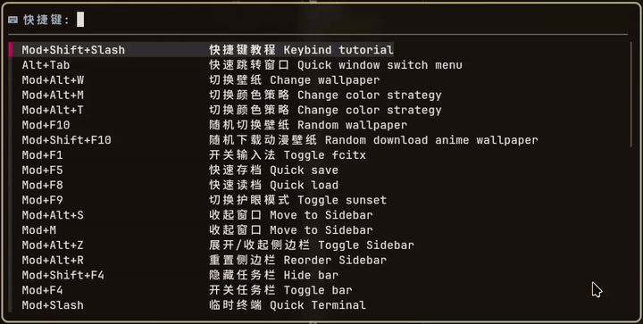

所有快捷键可以在 `.config/niri/binds.kdl` 查看，有详细的中文注释。

最常用的：

|  快捷键   |      功能      |
| :-------: | :------------: |
|  super+Z  |   软件启动器   |
|  super+Q  |    关闭窗口    |
|  super+T  |      终端      |
| super+G/O |  overview概览  |
| super+H/L | 向左右切换聚焦 |
| super+u/i |   切换工作区   |

快捷键看着多，但是都有迹可循。桌面快捷键大部分以 `Mod 键`，也就是 `Win 键` 开头，配合三套上下左右。

1. 方向键
2. vimkey（hjkl对应左下上右）
3. 游戏方向键（wasd）

加上 `Ctrl` 就是和窗口相关，通常是移动窗口；加上 `Shift` 就是切换功能或者和显示器相关；加上 `Alt` 通常和软件相关。如果是 `Mod+F1~12` 就是特殊功能。

## 壁纸和模糊

壁纸功能的核心是 waypaper 和 awww。壁纸默认存放路径为 `~/Pictures/Wallpapers`。

- 壁纸切换

  `Super+Alt+W` 或者右键点击任务栏上的取色器模块打开 waypaper 切换壁纸。waypaper 的配置文件在 `~/.config/waypaper/`。waypaper 里按下 Z 键可以切换简洁模式（简洁模式默认开启）。

  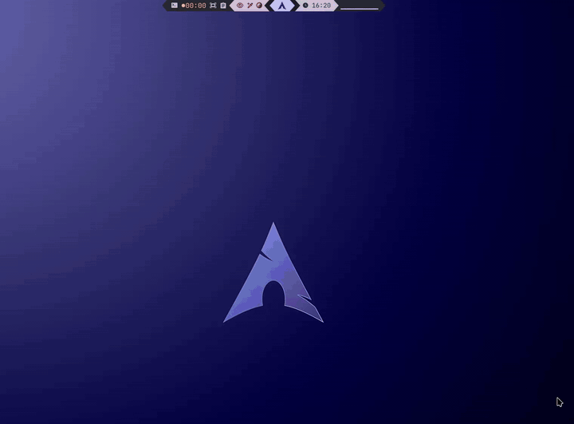

  还可以使用 `Mod+F10` 快捷键随机切换壁纸。
  
- 随机下载动漫壁纸并切换

  使用 `Mod+Shift+F10` 可以随机从网上下载动漫壁纸并切换。随机下载的壁纸会保存到壁纸目录下的 `api-random-download` 目录。
  
  此功能的脚本在 `~/.config/scripts/random-anime-wallpaper.sh`。脚本开头的 `KEEP_COUNT=40` 设置了最多保存多少张壁纸，默认是 40。超过后会自动按照时间顺序删除，所以如果你随机到了喜欢的壁纸记得从 `api-random-download` 目录取出来。

- 桌面自动模糊脚本（已经弃用）

  通过脚本在聚焦时自动切换壁纸为当前壁纸的模糊版本。第一次打开 Niri 会通过 ImageMagick 生成模糊壁纸，CPU 会起飞一会。Niri 已支持窗口模糊，故弃用。如果你不想用测试分支的 Niri，一定要用这个的话可以编辑 `~/.config/niri/config.kdl` 取消下图中 spawn... 那行开头代表注释的 `//`：

  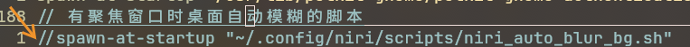
  
  脚本路径：`~/.config/scripts/niri_auto_blur_bg.sh`

  缓存文件路径：`~/.cache/blur-wallpapers/`

- overview概览背景壁纸

  切换壁纸时通过 waypaper 配置文件中的 `post_command` 功能自动运行 `~/.config/scripts/niri_set_overview_blur_dark_bg.sh` 脚本设置 overview 背景为当前壁纸的暗色模糊版本。

  缓存文件位置：`~/.cache/blur-wallpapers/`

  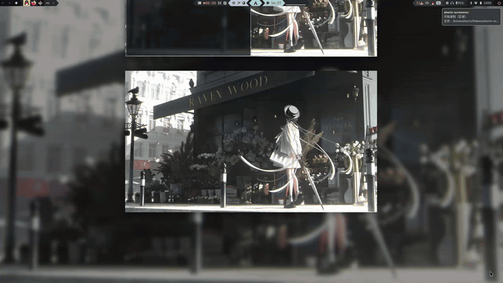

- 主题颜色切换

  更换壁纸时调用 `.config/scripts/matugen-update.sh` 生成主题。使用 Matugen 提取壁纸主要色生成所有需要的主题颜色。Matugen 的配置文件在 `~/.config/matugen/`，模板在 `~/.config/matugen/templates/`，你可以自行添加或修改模板。
  
  - 更换颜色模式

    中间任务栏上的取色器模块或者快捷键 `Super+Alt+T/M` 可以打开 Matugen 配置菜单。可以切换浅色、暗色和各种不同的颜色生成方案。自 Matugen 4.0 开始增加了 `随机主色` 和 `固定第一主色` 两个模式。固定第一主色模式使用 `matugen --source-color-index 0` 强制使用第一主色。随机主色模式会在 Matugen 提供的多个主色之间轮换。这个配置菜单脚本的路径在 `~/.config/scripts/matugen-select-type.sh`。

    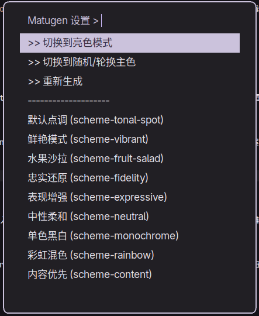

## 输入法

输入法使用 Fcitx5 + RIME，默认输入方案是雾凇拼音，接入了万象语法模型和 `rime-llm-translator`，`Super+空格` 切换输入法。第一次启动输入法可能会卡死，用 `Mod+F1` 可以开关输入法进程。

- 输入法配置

  切换到 RIME 输入法引擎后按下 `F4` 可以打开 RIME 输入法菜单，如果你的 Shorin-Niri 是包括常用软件的完整安装的话里面会包含主流的五笔86、明月拼音、小鹤双拼和注音输入方案。
  
  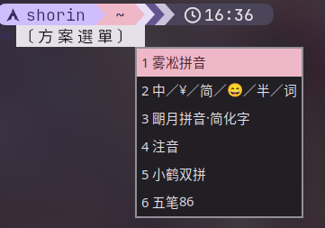

  配置 Fcitx5 可以使用 `fcitx5-configtool`，程序菜单中叫 `Fcitx5 配置`。

  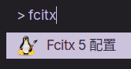

- `rime-llm-translator`

  [详情点击此处跳转仓库](https://github.com/SHORiN-KiWATA/rime-llm-translator)

  给 RIME 输入法接入大模型进行云拼音联想，支持 TUI 图形化配置。输入时按下 `vv` 使用此功能。运行 `rime-llm-config` 可以打开 TUI 进行配置。

  
更多输入法信息看 [ShorinWiki_中文输入法](中文输入法.md)。

## 剪贴板

> [SHORiN-KiWATA/cliphist-tui](https://github.com/SHORiN-KiWATA/cliphist-tui)

剪贴板使用自制的 `cliphist-tui` TUI 剪贴板，后端是 `wl-clipboard` 和 `cliphist`。`Mod+Alt+V` 打开剪贴板。

## 任务栏

任务栏是 Waybar。我制作了两个预设，`Super+F2` 是顶部 Waybar，灵感来自 [mechabar](https://github.com/sejjy/mechabar)。`Super+F3` 是底部 Waybar，仿照 Win11 的任务栏布局。还可以用 `Super+F4` 关闭任务栏，`Super+Shift+F4` 隐藏任务栏。

顶部 Waybar 的配置文件在 `~/.config/waybar/`，底部 Waybar 的配置文件在 `~/.config/waybar-niri-Win11Like/`。编辑 `config.jsonc` 可以设置模块的开关、任务栏在哪些显示器上显示等内容。`modules.jsonc` 里是具体的模块功能。`style.css` 设置了 Waybar 的外观样式。`colors.css` 是由 Matugen 根据模板生成的颜色文件。

鼠标悬停在每个模块上可以显示模块的作用。

### 任务栏模块功能介绍（从左到右）

- 工作区切换模块 对应 `config.jsonc` 里的 `niri/workspaces`

  左键可以切换工作区，因为 Niri 的工作区是动态增删的，所以使用图标区分而不是数字。

  

- 应用模块 `cffi/niri-taskbar`

  用于显示已经开启的应用，此功能由第三方的 `waybar-niri-taskbar` 提供。

  

- 应用title名称模块 `niri/window`

  用于显示当前聚焦窗口的 title 名称，这个名称可以在设置窗口规则时使用。

  

- 常用命令模块 `custom/actions`

  包含了大部分常用命令。

  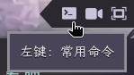

  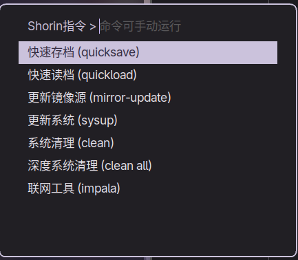

- 录屏模块 `custom/wfrec`

  支持 wl-screenrec 后端和 wf-recorder 后端的方便录屏模块，尤其录制 GIF 的功能相当好用，支持基本录制设置。简单录屏一般用这个，复杂的工程会用 OBS Studio。
  
  此脚本由 `shorin-contrib-git` AUR 包提供，运行 `shorin screenrec` 命令开启。录制文件存放于 `~/Videos/shorin-screenrec/`。

  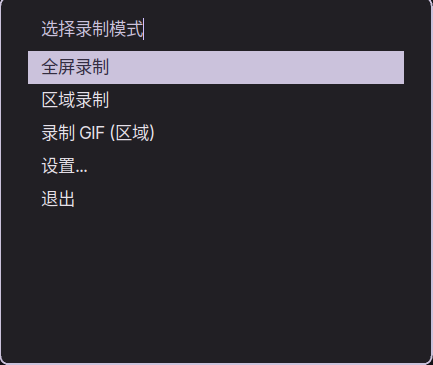

  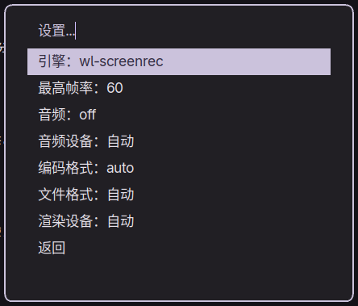

- 截图模块 `custom/screenshot`

  截图保存目录：`~/Pictures/Screenshots/`

  左键使用 `grim` 和 `slurp` 简单截图，仅进入剪贴板。

  
  
  右键打开截图菜单（`~/.config/waybar/scripts/power-screenshot.sh`），支持一系列设置。可以从 Niri 和 `grim` 两种后端之间切换，还可以设置是否编辑，编辑使用 `satty` 或者 `swappy`（新版本 Shorin-Niri 已经移除了 `swappy`，要使用的话得自己装）。
  
  

  中键可以长截图，详情看：[SHORiN-KiWATA/wl-longshot](https://github.com/SHORiN-KiWATA/wl-longshot)

- 剪贴板模块 `custom/clipboard`

  左键可以打开剪贴板。

- idle模块 `idle_inhibitor`

  眼睛图标是激活，眼睛被划了一道线是禁用。如果使用了类似 swayidle 或者 hypridle 的程序，激活这个模块可以禁止熄屏。

- 取色器模块 `custom/colorpicker`

  左键可以提取颜色复制到剪贴板。右键可以打开 waypaper 切换壁纸。中键可以打开 Matugen 配置菜单。

- 性能模式模块 `power-profiles-daemon`

  后端是 `power-profiles-daemon`。左键可以在省电（叶子）、平衡（太极）和性能（闪电）三种性能模式之间切换。

- 启动器模块 `custom/applauncher`

  用于显示 Logo。左键可以打开 fuzzel 程序启动器，右键可以打开终端。

- 时间模块 `clock`

  悬浮可以显示日期。左键打开 `gnome-clocks`。右键打开 `gnome-calendar`。

- 音频可视化模块 `custom/cava`

  此音频可视化模块脚本位于 `~/.config/waybar/scripts/cava.sh`。后端使用 cava。

- 更新模块 `custom/updates`

  `~/.config/waybar/scripts/check-updates.sh`，显示待更新的 pacman 和 AUR 软件。左键可以调用 `shorin sysup` 更新系统，右键可以调用 `shorin checkallupdates` 显示所有待更新的项目。

  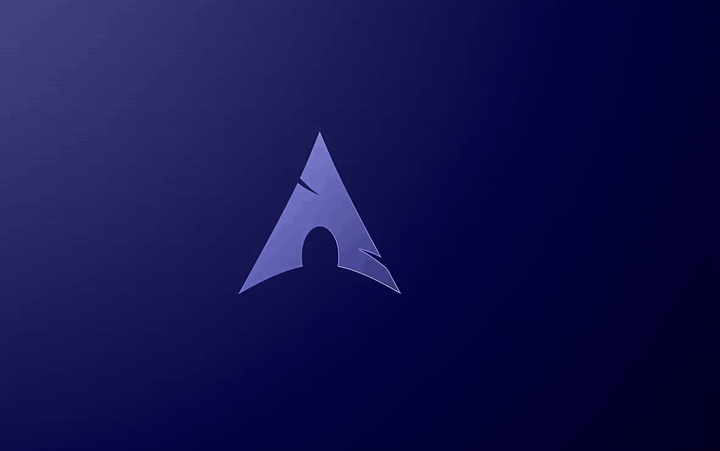

- 后台应用模块 `tray`

- 亮度模块 `group/ddcutil`

  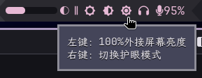

  这是一个合集模块。月亮是笔记本内屏亮度调节，三个太阳是使用 ddcutil 调节外接屏幕亮度，没有做成滑块是因为会导致笔记本内屏卡死。如果切换外屏亮度的功能没有生效可以确认 `modules.jsonc` 里此模块的显示器是否正确指定。
  
  右键大太阳还可以开关护眼模式（晚上的时候才有护眼效果）。护眼模式的设置在 `~/.local/bin/toggle-wlsunset`，可以设置地理位置和色温。

- 隐私模块 `privacy`

  

  如果有软件正在使用桌面门户进行屏幕分享，这个模块才会出现。

- 音频模块 `group/audio`

  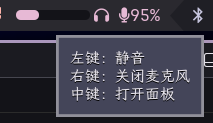

  这是个合集模块。通过滑块调整系统音量，滚轮调整麦克风音量。左键静音，右键关闭麦克风。中键打开 `pavucontrol` 面板。

- 蓝牙模块 `bluetooth`

  左键可以打开连接蓝牙的 TUI（`bluetui`），右键禁用/启用蓝牙设备。

  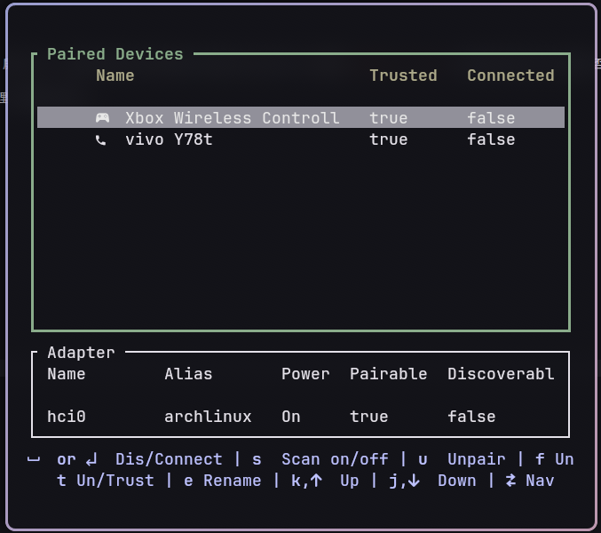

  `S 键` 搜索，`回车` 连接

- 网络模块 `network`

  左键可以打开 `impala` 连接 Wi-Fi，右键可以打开 `nm-connection-editor` 进行高级网络配置。

  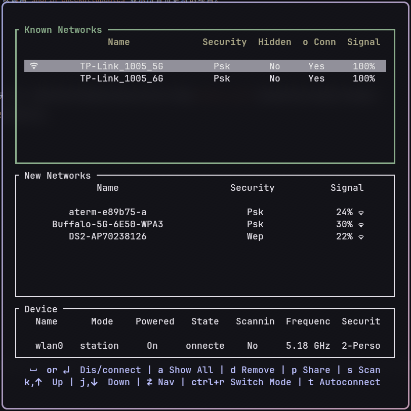

  `S 键` 扫描网络。`Tab 键` 切换板块。`回车` 连接。

  如果 impala 无法正常使用可以运行 `nmtui` 命令打开 nmtui 进行联网。

## 锁屏

锁屏使用 `hyprlock`，配置文件存放在 `~/.config/niri/hyprlock.conf`，放在 Niri 的目录下是为了避免和 Hyprland 共存时产生配置文件冲突。

`Mod+Alt+L` 锁屏。

我移除了类似 `swayidle` 之类自动锁屏熄屏休眠的程序，如果你想暂时离开或者节省电量，可以使用 `Super+Alt+P`，会自动关闭屏幕并锁屏和休眠。

## 截图和录屏

截图使用 Niri 自带的截图。编辑截图使用 `satty`。编辑截图功能的使用方式是截图后再按下编辑截图快捷键（默认是 `Mod+Shift+S`）读取剪贴板中刚刚截的那张图进行编辑。

Satty 的配置文件在 `~/.config/satty/`。截图保存位置可以通过 Niri 配置文件 `~/.config/niri/config.kdl` 中的 `screenshot-path` 设置，默认在 `~/Pictures/Screenshots/Niri-screenshots/`。

录屏使用任务栏的录屏模块和 OBS Studio。Niri 的录屏需要 `xdg-desktop-portal-gnome` 桌面门户，如果 OBS 没有出现 `屏幕采集（PipeWire）` 选项的话请检查该门户是否正常工作。

## Alt+Tab 跳转窗口

- Niri 自带的 recent-window

  `Super+Tab` 进行有缩略图的窗口跳转。`Super+波浪键` 仅仅在当前应用的窗口之间跳转。

- fuzzel 菜单

  `Alt+Tab` 打开窗口跳转菜单。支持输入窗口名称搜索后直接跳转，效率极高。`Ctrl+J/K` 选择，`回车` 或 `Ctrl+L` 跳转，`Ctrl+H` 关闭窗口。

## 终端仿真器和 Shell

终端使用 Kitty，配置文件在 `~/.config/kitty/kitty.conf`。

提示符美化使用 Starship，配置文件在 `~/.config/starship.toml`。这个文件由 Matugen 生成，模板位于 `~/.config/matugen/templates/starship-colors.toml`。如果你要更改 Starship 配置，应该更改 Matugen 模板，否则变更壁纸后会被覆盖。或者你可以注释掉 `~/.config/matugen/config.toml` 中 Starship 相关的内容禁用它的 Matugen 同步。

Shell 使用 Fish，配置文件在 `~/.config/fish/`，其下的 `config.fish` 文件和 `function` 目录里的文件定义了所有的功能。

- `f`命令

  这是我自制的二次元老婆生成器，用 `fastfetch` 显示系统信息的同时随机下载二次元图片替代掉原本的 Arch logo。

  脚本位置：`~/.config/scripts/fastfetch-random-wife.sh`

  缓存位置：`~/.cache/fastfetch_waifu`

- `ls`

  查看目录的功能使用 `eza`。

- `cd`

  切换目录功能使用 `zoxide`，只要切换过一次目录，就只需要输入路径中的关键词，不需要输入完整目录了。
  
## 文档管理器

主要使用 Thunar。`Mod+E` 打开。我制作了一些好用的自定义功能：

- 右键视频显示多媒体信息

- 右键视频转 GIF

- 右键图片转 PNG

- 把复制的文件粘贴为链接（`Ctrl+Shift+V`）

- 粘贴剪贴板图片为文件（`Ctrl+Alt+V`）

- 右键从此处打开 VS Code

- 右键获取文件所有权

可以在 Thunar 的左上角点击 `编辑` --> `配置自定义动作`

> btw，我保留了 `右键从此处打开终端` 是英文 `Open Terminal Here` 的设计。

除了 Thunar，Nautilus 也作为 `xdg-desktop-portal-gnome` 的依赖被安装了，在软件菜单里叫文档，图标是个蓝色的柜子。我还安装了 Yazi 作为终端文档管理器，方便在终端管理文件。

## 显示管理器（登录界面）

显示管理器使用轻量快速的 Ly，纯 TUI 界面，同时支持简单的背景动画，用于管理多用户登录和多桌面环境切换。Ly 的配置文件在 `/etc/ly/config.ini`。

## 常用命令

大部分常用命令由 `shorin-contrib-git` AUR 包提供，运行 `shorin` 命令可以看到所有可用的命令和简介，我在安装时已经用 `shorin link` 命令将它们链接到了 `~/.local/bin` 下，使用时可以不加 `shorin` 作为父命令。

- `shorinniri`
  
  `init` 初始化
  
  `remove` 移除 Shorin-Niri

  `update` 更新

  `protect <文件路径>` 更新时保护文件

- `quicksave`

  快速存档（`Mod+F5`）。可以通过 `-d` 选项指定快照的描述。`-h` 查看更多用法。

  如果你要做不了解或者有风险的事情，请一定先存档。

- `quickload`

  快速读档（`Mod+F8`）。`-h` 查看用法。

- `mirror-update`

  使用 `reflector` 更新 pacman 的镜像源。

- `sysup`

  更新系统。请使用此命令更新系统而不是直接使用 `pacman -Syu`。

- `clean`

  清理系统。自动清理孤立软件包、清理软件包缓存、清理过于老旧的系统日志、清空回收站和缩略图、清理 flatpak 残留等等。

  `clean all` 可以删除所有现有的快照，深度清理系统。

- `pac`

  TUI 安装软件。

- `pacr`

  对应 `pac`，用于卸载软件。

- `pacd`

  对应 `pac`，用于降级软件。需要 `downgrade`。

- `pacrrr`

  卸载软件前先追踪软件残留文件，用于避免软件在 home 目录下残留文件。需要 `strace`。

- `pak`

  TUI 安装 Flatpak 软件。

- `pakr`

  卸载 Flatpak 软件。

- `sudo change-grub-theme`

  可以更换 GRUB 主题。只要主题文件存放在 `/usr/share/grub/themes` 里，就可以检测到。

  使用旧脚本安装的用户可以 `curl -L shorin.xyz/change-grub-theme | sudo bash` 安装这个脚本。

## `niri-shorin-fork-git`

这是我的 niri 分支。

新增了以下几个功能：

- 晃动鼠标放大

    ```ini
    cursor {
        shake-to-enlarge {
            //off
            grow
            grow-speed 0.01
            threshold 2000
            hold-duration-ms 1500
            zoom-factor 5
        }
    }
    ```

- 屏幕放大

    ```ini
    magnifier {
        // off
        zoom-factor 3
        //track-cursor false
        //scale-cursor false
    }

    binds{
        Mod+Alt+WheelScrollUp   { adjust-magnifier-zoom 0.2; }
        Mod+Alt+WheelScrollDown { adjust-magnifier-zoom -0.2; }
        Mod+Shift+Z         { toggle-magnifier; }
    }
    ```

- 网格概览

    ```ini
    grid-overview {
        default-mod-action
        gap 16
        padding {
            left 64
            right 64
            top 48
            bottom 48
        }
        grid-all-monitors true
    }

    binds {
        Mod hotkey-overlay-title="切换网格总览界面 toggle grid overview" repeat=false { toggle-grid-overview; }
    }
    ```

- 截图支持 stdout

    ```bash
    niri msg action screenshot --stdout
    ```

- 支持单独给 mod 键绑定功能

    ```ini
    Mod hotkey-overlay-title="切换网格总览界面 toggle grid overview" repeat=false { toggle-grid-overview; }
    ```

-  热角

    ```ini
    gesture {

        hot-corners {
            bottom-left { grid-overview }
        }
    }
    ```
- 窗口规则

    ```ini
    window-rule {

        match is-floating=true
        ignore-grid-overview true
    }
    ```
- grid 和 overview 打开后中键直接关闭窗口。
- grid 和 overview 中 hjkl 切换聚焦，聚焦窗口在边缘时依旧往边缘切换聚焦会切换工作区。