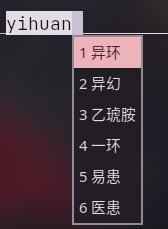

目录

- [fcitx5-rime](中文输入法.md#fcitx5)
- [ibus-rime](中文输入法.md#ibus)
- [输入法异常的解决办法](中文输入法.md#输入法异常的解决办法)

---

常用的输入法框架有 Fcitx5 和 IBus，Fcitx5 更现代，功能更多，建议使用。不同桌面配置方法会略有不同，注意区分。

>GNOME 桌面和 IBus 的兼容会更好，配置过程也更简单，可以不装 Fcitx5。

## Fcitx5

1. 安装基础框架

    ```bash
    sudo pacman -S fcitx5-im

    # fcitx5-im 包含了 fcitx5 的基本包
    ```

2. 安装中文输入方案

    你可以**自己选择要安装的输入方案**，因为我使用全拼，所以本文主要是全拼方案的教程。

    - 中文输入合集 `fcitx5-chinese-addons`

      这里面包含了所有常用的中文输入方案（拼音、五笔、双拼等等）。安装简单，但是输入效果一般，不推荐使用。

      ```bash
      sudo pacman -S fcitx5-chinese-addons
      ```

    - RIME 中州韵引擎+雾凇拼音

      现有两大主流方案，万象和雾凇。万象的全拼分词效果很差，所以全拼用户强烈推荐使用雾凇，双拼用户推荐使用万象。

      1. 安装 RIME（中州韵）+雾凇拼音

          ```bash
          sudo pacman -S fcitx5-rime rime-ice-git
          ```

            >`fcitx5-rime` 是输入法引擎。

            >`rime-ice-git` 雾凇输入方案，这个包需要从 AUR 或者 archlinuxcn 安装。

            >其他方案：`rime-wanxiang-pinyin` 万象拼音（这个包在 archlinuxcn 上）；`rime-wanxiang-flypy` 万象小鹤双拼（archlinuxcn 源）；`fcitx5-mozc` 日语输入法；`rime-wubi` 五笔输入法。

          现在打开 `fcitx5-configtool` 就可以添加 `rime（中州韵）` 到输入法列表中了，添加完成后重启输入法，`Ctrl+空格`切换到 RIME 后会自动初始化。默认的输入方案是繁体的 `明月拼音`，按下 F4 可以打开设置菜单调整为简体。下面我们编辑配置配置文件将默认输入方案改成雾凇拼音。

      2. 编辑配置文件启用 RIME 雾凇拼音

            ```bash
            mkdir -p ~/.local/share/fcitx5/rime
            vim ~/.local/share/fcitx5/rime/default.custom.yaml
            ```

            >第一行命令 `mkdir -p` 检查文件夹是否存在，不存在的话创建。第二行编辑配置文件。

             写入以下内容设置 RIME 的默认方案为雾凇拼音：

            ```yaml
            patch:
              # 这里的 rime_ice_suggestion 为雾凇方案的默认预设
              __include: rime_ice_suggestion:/
            ```
            重启输入法之后默认输入方案就变成雾凇拼音了。

      3. 可选：F4 在多个输入方案间切换

            用 `ls /usr/share/rime-data/*.schema.yaml` 命令可以看到当前所有可用的输入方案，去掉文件名的 `.schema.yaml` 就是 `schema` 名，写进 `default.custom.yaml` 后可以在 F4 菜单里切换不同的输入方案，以下是示例（注意缩进，RIME 的配置文件对缩进很严格）：

            ```yaml
            patch:
              schema_list:
                - schema: luna_pinyin_simp
                - schema: rime_ice
                - schema: wanxiang
                - schema: double_pinyin_flypy
                - schema: wubi86
                - schema: bopomofo
            ```
            > `luna_pinyin_simp` 是 RIME 自带的明月拼音；`wanxiang` 是万象拼音；`double_pinyin_flypy` 是小鹤双拼（由 `rime-ice-git` 提供）；`bopomofo` 是注音输入法。

      4. 可选：配置输入法模型

            推荐给雾凇拼音接入万象的语法模型，可以提高长句联想效果。你可以现在尝试打 `苍茫的天涯是我的爱`，大概率会打出 `苍茫的填鸭式我的爱`，如果配置了语法模型就可以解决这个问题。

            1. 安装模型

               可以直接从 AUR 或者 archlinuxcn 安装：
               ```bash
               yay -S rime-wanxiang-gram-zh-hans
               ```
               >或者从 GitHub 手动下载：[点击此处下载模型](https://github.com/amzxyz/RIME-LMDG/releases/download/LTS/wanxiang-lts-zh-hans.gram)，下载完成后把模型放在 `~/.local/share/fcitx5/rime/`。

            2. 编辑雾凇拼音的配置文件

               ```bash
               vim ~/.local/share/fcitx5/rime/rime_ice.custom.yaml
               ```

               写入：

               ```yaml
               patch:
                 "grammar/language": wanxiang-lts-zh-hans
               ```

            3. 重新启动输入法

               现在再打 `苍茫的天涯是我的爱` 试试。

      5. 可选：[接入LLM大模型进行云拼音](https://github.com/SHORiN-KiWATA/rime-llm-translator)

            这是我自己的项目，功能是给 RIME 输入法接入大模型进行拼音联想。把拼音传给大模型，让大模型猜出正确的句子，一键安装，TUI 图形化界面修改配置，感兴趣的可以试试。
      
      安装到这里结束，接下来是配置的部分。

3. 可选：了解输入法的实现

   <details><summary>[展开/收起]</summary>

    >https://fcitx-im.org/wiki/Using_Fcitx_5_on_Wayland#GTK_IM_MODULE

   输入法的实现涉及主要有两种方式。其一是通过输入法模块跟输入法框架通信的传统实现，其二是通过 Wayland 协议以 Wayland 合成器为中间人跟输入法框架通信的现代实现。对于前者，首先软件要提供输入法模块，我们再设置对应的环境变量告诉软件使用哪个模块，输入法就可用了；对于后者，软件需要适配 Wayland 的 `text-input` 协议，输入法框架要支持`input-method`协议，合成器同时支持这两类协议，无须配置环境变量输入法就能正常工作。

   以下是常用的输入法模块对应的环境变量：

   - `GTK_IM_MODULE` 适用于 GTK2/3/4 应用和以 X11/XWayland 运行的 Electron/Chromium 应用。

   - `QT_IM_MODULE` 适用于 Qt 应用。

   - `XMODIFIERS` XIM 协议。在 Wayland 环境下仅适用于 XWayland 兼容层运行的 Xlib/GTK2/Qt4 应用。

   - `SDL_IM_MODULE` 适用于 SDL 应用。

   - `--enable-features=UseOzonePlatform --ozone-platform=wayland --enable-wayland-ime --wayland-text-input-version=3` 

     这一项比较特殊，不是环境变量，而是 Electron/Chromium 应用的命令行参数，典型的 Electron 应用有LinuxQQ、夸克等。这段参数会让软件以 Wayland 运行，走 Wayland 的协议。不用全写，通常只写`--ozone-platform=wayland`就行，有问题再说。

     > `--enable-features=UseOzonePlatform`启用 Ozone 抽象层（跨平台兼容相关）；

     > `--ozone-platform=wayland`让 Ozone 以 Wayland 运行；

     > `--enable-wayland-ime` 启用 Wayland 输入法支持；

     > `--wayland-text-input-version=3`设置协议版本。

   >过去不太好分辨一个软件是用什么开发的，支持什么模块或协议，如今可以直接拿 AI 查了。

   </details>
   <br>
4. 正确设置环境变量和启动参数

    在 Wayland 环境下，以 Wayland 运行的软件理论上输入法开箱即用。我们真正需要处理的只有那些在 Wayland 环境下走 XWayland 兼容层运行的 X11 应用和极个别 Qt 应用。

    - 配置文件位置

      记住下面这些编辑环境变量的地方，尤其注意**调整单个应用的环境变量**的方法。

      系统全局配置在`/etc/environment`；对应的用户个人配置在`~/.config/environment.d/`目录下，需新建`*.conf`文件；

      >`*.conf`中的星号叫`通配符`，代表任意字符。
      
      调整单个应用的环境变量需要复制`/usr/share/applications`中的`.desktop`到用户个人的`~/.local/share/applications`中后修改`Exec=`行，这是该`.desktop`文件启动时使用的命令。推荐从 AUR 安装`pins-git`方便编辑。
  
      环境变量用`env`命令在命令前传入：`Exec=env GTK_IM_MODULE=fcitx linuxqq`；命令行参数本质是命令的选项，所以接在命令的后面：`Exec=linuxqq --ozone-platform=wayland %U`。

      窗口管理器的话可以在配置文件设置环境变量。

      接下来开始实操。

    - 最简单的配置方法口诀
    
      **在配置环境变量的地方写入`XMODIFIERS=@im=fcitx`，日常使用遇到无法输入的情况时再单独调整那个软件的环境变量。**

      - 示例：

          在用户空间配置环境变量的地方设置 `XMODIFIERS` 环境变量让 XWayland 应用能使用输入法：

          ```
          vim ~/.config/environment.d/ime.conf
          ```
          ```
          XMODIFIERS=@im=fcitx
          ```

          日用的时候发现 LinuxQQ 不能使用输入法，需要单独进行调整。用 AI 一查，知道 LinuxQQ 是 XWayland 运行，并且是 Electron 应用。想继续以 XWayland 运行就在`.desktop`加上`GTK_IM_MODULE=fcitx`变量，想用 Wayland 运行就加上 `--ozone-platform=wayland` 参数。大概是这样的使用逻辑。

          >得益于 Linux 桌面环境发展，软件自己解决了大部分事情，软件无法使用输入法的情况非常少见了，~~GNOME 甚至完全不设置环境变量都能正常使用输入法~~。

    - 更具体的配置方法

      <details close>
      <summary>[展开/收起]参考 Fcitx5 的 Wiki，以下是我推荐的配置</summary>


      ```
      vim ~/.config/environment.d/ime.conf
      ```
      ```
      XMODIFIERS=@im=fcitx
      QT_IM_MODULES="wayland;fcitx"
      ```
      >`QT_IM_MODULES`是Qt新版本的的写法，自动回退机制。
      ```
      vim ~/.gtkrc-2.0
      ```
      ```
      gtk-im-module="fcitx"
      ```
      ```
      mkdir -p ~/.config/gtk-3.0
      vim ~/.config/gtk-3.0/settings.ini
      ```
      ```
      [Settings]
      gtk-im-module=fcitx
      ```
      ```
      mkdir -p ~/.config/gtk-4.0
      vim ~/.config/gtk-4.0/settings.ini
      ```
      ```
      [Settings]
      gtk-im-module=fcitx
      ```
      </details>

5. 调整系统设置

   - GNOME 的话

      1. 打开 Fcitx5 配置添加 RIME。

      2. 安装扩展

          商店搜索 extension，安装蓝色的 extensionmanager，然后在扩展商店安装 [input method panel](https://extensions.gnome.org/extension/261/kimpanel/) 扩展。

   - KDE 的话

     1. 打开 `系统设置` > `键盘` > `虚拟键盘`，选择 `fcitx5 wayland 启动器`，记得 `应用`。
     2. `系统设置` > `语言和时间` > `输入法`，添加 `rime（中州韵）`。`配置全局选项` 可以设置切换输入法的快捷键。`配置附加选项` 可以进行一些自定义设置。

   - Wayland 合成器的话

     1. 打开 `fcitx5配置` 进行设置。

     2. 在合成器配置文件里设置自动启动 Fcitx5。

        - Niri

          ```text
          spawn-at-startup "fcitx5"
          ```

6. 可选：美化

   浏览器搜索 fcitx5 themes，下载自己喜欢的主题放到 `~/.local/share/fcitx5/themes` 目录下。在 `fcitx5配置` 里的 `经典用户界面` 里进行设置。

7. RIME 自定义词库

    RIME 的词库是离线的，无法打出热词，这个时候就需要自定义词库。如果你觉得默认的联想不适合你的使用场景，也可以自定义词库。以下是一个简单的方法，了解方法之后你甚至可以给 AI 提供素材，根据你的使用场景创建专属于你自己的自定义词库。

    1. 在 `~/.local/share/fcitx5/rime` 目录下新建 `custom_phrase.txt`。

        ```bash
        vim ~/.local/share/fcitx5/rime/custom_phrase.txt
        ```
    2. 按照这个格式写入自定义词库：`词语<TAB>ciyu<TAB><可选设置权重>`

        > `<TAB>` 代表制表符（Tab 键）分割，不能使用空格；`ciyu` 是具体单词或者短语的拼音；`<可选设置权重>` 代表该词在候选列表中的排序高低，数字越大越高。

        以下是一个示例配置：

        ```text
        # encoding: utf-8
        # 注释以 # 开头
        异环	yihuan	100
        异幻  yihuan  99
        腾讯	tx
        梦里不知身是客，一晌贪欢	shangmengtanhuan
        ```
    3. 重启输入法

        ```bash
        fcitx5 -r
        ```

    效果如图

      - 权重排序

        

      - 自定义短语

        

## ibus

<details close><summary>[展开/收起] GNOME 和 IBus 兼容性好，无需配置，开箱即用。</summary>

> 参考：[Rime - Arch Linux 中文维基](https://wiki.archlinuxcn.org/zh-hant/Rime) | [可选配置（基础篇） | archlinux 简明指南](https://arch.icekylin.online/guide/advanced/optional-cfg-1#%F0%9F%8D%80%EF%B8%8F-%E8%BE%93%E5%85%A5%E6%B3%95) | [RIME · GitHub](https://github.com/rime)

1. 安装 IBus-rime

    ```bash
    sudo pacman -S ibus ibus-rime rime-ice-pinyin-git
    ```

    > `ibus`是ibus输入法的基本包
    >
    > `ibus-rime`是中州韵
    >
    > `rime-ice`是雾凇拼音输入法方案
    >
    > `ibus-mozc` 是日语输入法

2. 在 GNOME 的设置中心 > 键盘 > 添加输入源 > 汉语，里面找到` rime` 并添加，如果没有的话登出一次

3. 编辑配置文件设置 rime 的输入法方案为 ice 雾凇拼音

    ```bash
    vim ~/.config/ibus/rime/default.custom.yaml
    ```

    如果没有文件夹的话自己创建。`mkdir ~/.config/ibus/rime/` 创建文件夹，`touch default.custom.yaml` 创建文件。写入以下内容：

    ```yaml
    patch:
        # 这里的 rime_ice_suggestion 为雾凇方案的默认预设
        __include: rime_ice_suggestion:/
    ```

    默认使用 super+空格切换输入法，可以在设置里修改。第一次切换至 rime 输入法需要等待部署完成。

4. 可选：安装扩展自定义 IBus

    商店搜索 extension 安装蓝色的扩展管理器，或者用命令安装

    ```bash
    flatpak install flathub com.mattjakeman.ExtensionManager
    ```

    安装两个扩展：

   - IBus tweaker

     设置里激活“隐藏页按钮”

   - Customize IBus

     需要登出一次

     设置里，常规页面取消“候选框调页按钮”。主题页面可导入 css 自定义主题，[GitHub - openSUSE/IBus-Theme-Hub: This is the hub for IBus theme that can be used by Customize IBus GNOME Shell Extension.(可被自定义 IBus GNOME Shell 扩展使用的 IBus 主题集合)](https://github.com/openSUSE/IBus-Theme-Hub)，这个网站有一些预设主题。背景页面可以自定义背景（这个无敌了，什么美化都比不过一张合适的自定义背景）。其他的选项就自己探索吧。

</details>

## 输入法异常的解决办法

<details close><summary>如果遇到了漏字、删不掉最后一个字母、大写锁定卡英文等异常</summary>

从AUR安装 `fcitx5-shorin-patched-git` 后重启输入法。

```
yay -S fcitx5-shorin-patched-git
```

</details>

下一节：[软件安装相关](软件安装相关.md)
