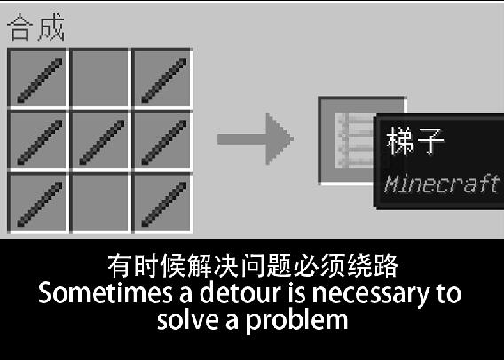

如果你使用 Linux 遇到了网络问题，可以配置代理。代理链接自己找。本文只推荐 GUI 程序，不涉及纯命令环境下的代理配置。

- [flclash（英文字母小写 L）](代理.md#flclash)

- [daed](代理.md#daed)

推荐使用 `flclash`。

## 测试代理是否生效

配置完代理后一定要测试是否生效。

```bash
curl -I www.google.com
```

返回由 `HTTP ... OK` 开头的一大串内容就是成功了。

## 安装临时图形环境

如果你目前没有桌面，可以安装一个临时的图形化环境运行接下来介绍的软件，我推荐使用 labwc。如果你已经有桌面了（任意桌面都可以），不需要这一步。

1. 安装 labwc

    ```bash
    sudo pacman -S labwc kitty
    ```

    labwc 是一个堆叠式窗口管理器，Kitty 是我使用的终端。会问你装哪个字体，回车默认就行。

2. 启动 labwc

    ```bash
    labwc
    ```

    labwc 打开之后是纯黑的，正常点击桌面选择 `terminal` 或者按下 `Super（Win 键）+ 回车键` 就能打开终端，选 `exit` 可以退出 labwc。

- 卸载 labwc

    要做的事情结束之后想删除这个临时图形环境可以使用这条命令：

    ```bash
    sudo pacman -Rns labwc
    ```

## flclash

flclash 支持随壁纸更换颜色，强推！

1. [添加 archlinuxcn](安装桌面环境前的准备.md#archlinuxcn源)

2. 安装

    ```bash
    pacman -S flclash
    ```

3. 启动

    ```bash
    flclash
    ```

4. 主页开启 TUN（虚拟网卡）

5. 导入链接

6. 右下角启动代理

7. 测试是否生效。

## daed

1. [添加 archlinuxcn](安装桌面环境前的准备.md#archlinuxcn源)


2. 安装

    ```bash
    yay -S daed
    ```

3. 启动

    ```bash
    sudo systemctl start daed
    ```

4. WebUI

    daed 的面板以 WebUI 方式提供。

    打开浏览器，访问 `localhost:2023` 即可进入 WebUI。导入订阅之后把订阅从右侧拖到左侧的群组。

5. 用其他设备访问 WebUI

    运行 `ip a` 命令获取本机 IP 地址。然后打开手机浏览器，在处于同一局域网的情况下访问以下地址：

    ```text
    你的 IP 地址:2023
    ```

    假设我的 IP 地址是 192.168.0.155，那就用手机浏览器访问 `192.168.0.155:2023`。

6. 开启 TUN 虚拟网卡

7. 测试是否生效。

## 不推荐使用的代理软件

<details><summary>[展开/收起]</summary>

### clash-verge-rev

0. [需要先添加 archlinuxcn](安装桌面环境前的准备.md#archlinuxcn源)

1. 安装

    ```bash
    pacman -S clash-verge-rev
    ```

    clash-verge 是基于 mihomo 内核和 Tauri 的面板软件。

2. 启动

    ```bash
    clash-verge
    ```

3. 启动 TUN 模式（虚拟网卡模式）

    如果出现 TUN 无法安装的情况，可以切换到 root 身份后打开 clash-verge。

    ```bash
    su -

    clash-verge
    ```

    还可以 `Ctrl+Alt+F2~F8` 切换到另一个 TTY 用 root 身份登录后启动 labwc，这样就是 root 身份开启的图形化环境了。

    如果启用 TUN 之后没有生效，可以尝试进入设置页面点击 Clash 内核边上的齿轮，切换成 mihomo alpha 内核，重启内核。

4. 记得导入链接和启动代理。

5. 测试是否生效。

</details>
