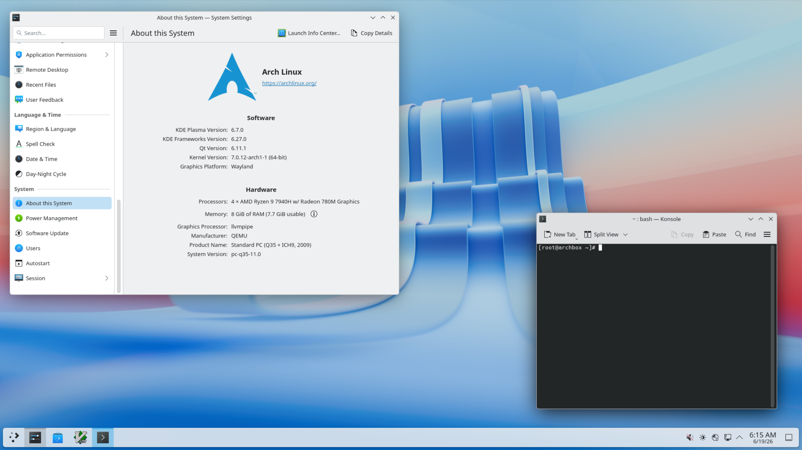
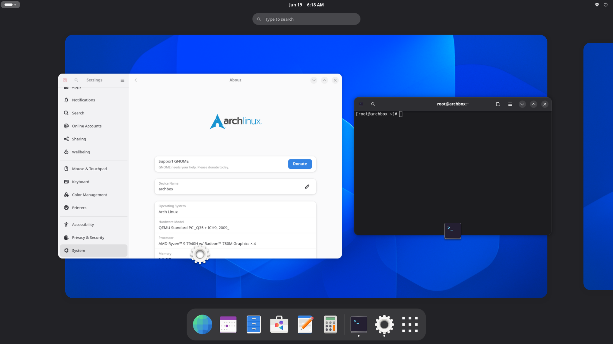
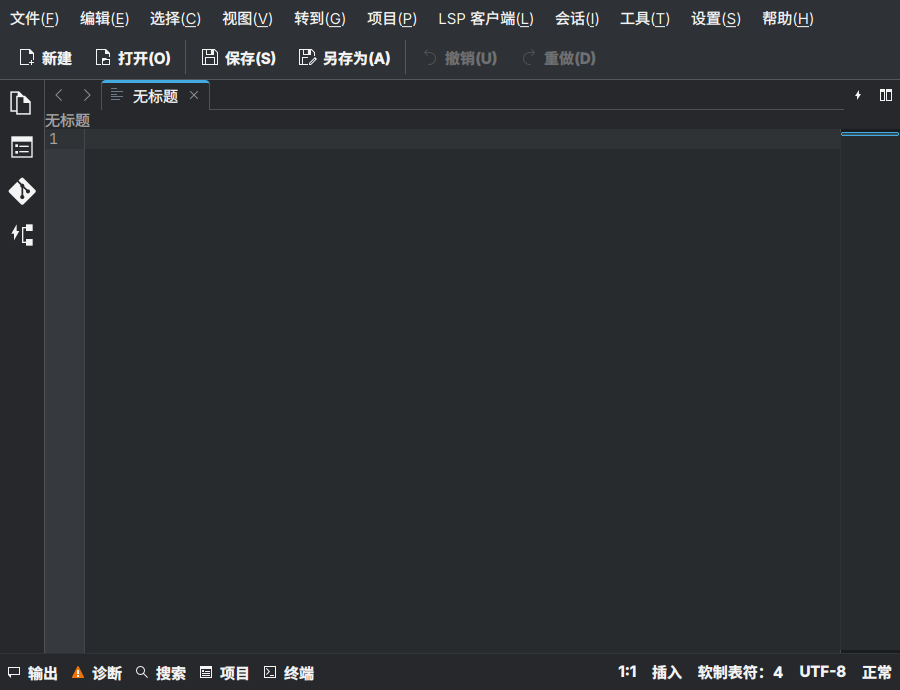
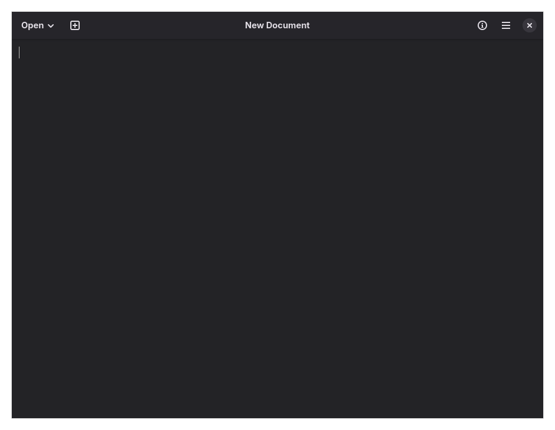

## 主要分类

- Desktop Environment 桌面环境

   简称 DE。这是传统意义上的桌面环境，提供 Windows 和 macOS 那样完整的桌面体验。

   代表：GNOME、KDE Plasma

- Window Manager 窗口管理器

   Wayland 下叫 Wayland Compositor（Wayland 合成器），为了方便以下统称 WM。只提供基础的窗口绘制、布局、动画效果等功能。以键盘和终端操作为主。大多数 WM 默认使用自动平铺（后文称`平铺式窗口管理器`），窗口会按照预设的逻辑自动调整大小，不同的 WM 的布局逻辑略有不同。现代的 WM 都同时支持平铺式和传统桌面那样的堆叠式。平铺式窗口管理器常常会导致软件的弹出窗口出现异常，兼容性不如堆叠式。

   代表：Hyprland、Niri、Sway

没有头绪的话建议从桌面环境上手，GNOME 和 KDE 二选一。桌面环境和 WM 可以同时安装，不会搞乱系统，再不济还可以快照回档，放心尝试！

### 选择GNOME还是KDE Plasma？

>KDE Plasma 预览图

>GNOME 预览图

两句总结它们的优缺点：KDE 功能众多且实用，但是初见会觉得杂乱无章。GNOME 很精简，但是精简过头变得太过简陋。

- 操作逻辑

   通常认为 GNOME 的默认设置更符合 MacOS 的直觉，KDE 的默认设置更符合 Windows 的直觉。但是 GNOME 和 KDE 都高度可自定义，因此无论 KDE 还是 GNOME 都可以通过一些额外的设置做到 Windows 或者 MacOS 的操作逻辑。区别在于 KDE 的设置里已经集成了大量自定义选项，而 GNOME 需要安装第三方扩展。

- 外观和自定义

   KDE 生态的软件主要使用 Qt，而 GNOME 主要使用 GTK，所以外观上会有区别，通常认为 GTK 的外观更加简洁。KDE 的系统设置里集成了相当多自定义相关的选项，所以比起 GNOME，KDE 自定义起来更方便、更灵活。GNOME 的自定义完全基于社区扩展，而扩展通常会在 GNOME 大版本更新后大面积失效，所以稳定性一般。

- 自带功能

   KDE Plasma 桌面环境自带的无级缩放、外屏亮度调节、概览中键关闭窗口、高级网络配置、平铺布局等功能都相当好用。GNOME 以精简为核心设计理念，所以默认没有这些功能。虽然可以通过额外安装扩展和软件达成类似的效果，但稳定性不如 KDE 自带。

听上去 GNOME 不如 KDE？因为 GNOME 的缺点同时也是优点。GNOME 没有乱七八糟的设置选项，没有增加记忆负担的快捷键。GNOME 的软件永远只满足核心功能，没有丑陋的工具栏，也没有眼花缭乱的按钮，~~甚至连最小化最大化按钮都没有~~。下面这两张图分别是 KDE 和 GNOME 生态的文本编辑器，很好地展示了两者在软件风格上的差异。

>KDE的文本编辑器

>GNOME的文本编辑器

GNOME 的桌面没有快捷方式干扰你欣赏壁纸，没有杂乱的任务栏分散你的注意力，一切都是为了更专注。设计之独特，只有用过才知道适不适合。

现在你了解了两者的区别，GNOME 和 KDE 之间选择一个安装吧。如果还是犹豫，选 KDE Plasma。

点击跳转：[GNOME](安装GNOME.md) | [KDE](安装KDE.md)

### 选择什么 WM？

- Niri 

   > 入门窗口管理器的首选

   现代滚动（scrolling）平铺式窗口管理器。特点是可横向无限延伸的滚动布局和围绕该布局进行的一系列逻辑自洽的设计。动画干练流畅，社区活跃，配置难度简单，对新手相当友好。入门窗口管理器的首选。

- Hyprland

   > 好看

   现代平铺式窗口管理器，默认布局是 `dwindle`，支持切换多种平铺布局（`dwindle`、`master`、`scrolling`）。动画丰富且高度可自定义，社区活跃，软件兼容优秀，配置难度普通。适合用不惯 Niri 或者想要深度美化桌面的人。

- Sway 

   > 轻量平铺，极速响应

   平铺式窗口管理器。无动画，精简、稳定、极速，轻量化的首选。

- Labwc 

   > 轻量堆叠

   堆叠式窗口管理器。没有动画，超级轻量，适合想给老电脑配轻量桌面且不喜欢自动平铺的用户使用。缺点是配置使用 XML，写起来难度较高。

我使用的是 Niri。学会一个 WM 就能知道其他 WM 如何使用，在一个 WM 上积累的配置可以轻易转移到别的 WM，所以不用太在意 WM 选择。

>如果对其他 WM 有兴趣的话可以看这个项目：[awesome-wayland](https://github.com/rcalixte/awesome-wayland)。

### 点击跳转：[Niri](安装Niri.md)

> 因 Hyprland 频繁破坏性更新，已移除 Hyprland 入门相关内容。

