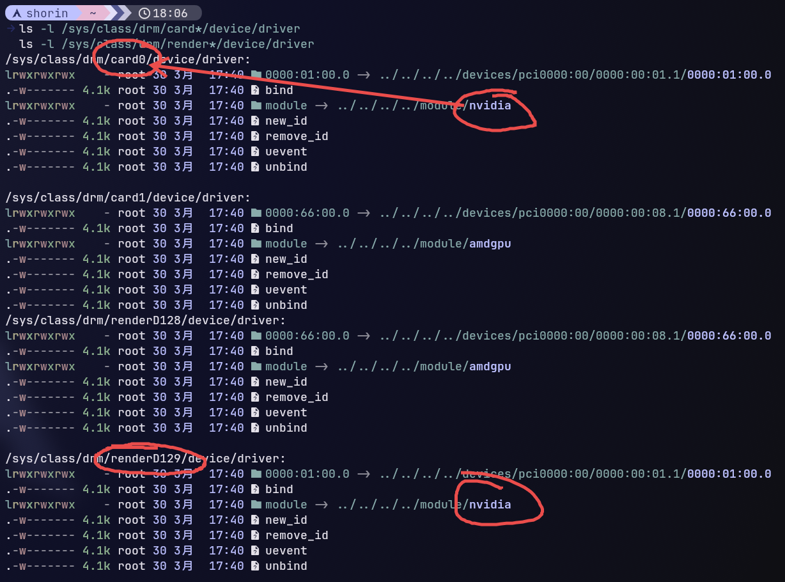
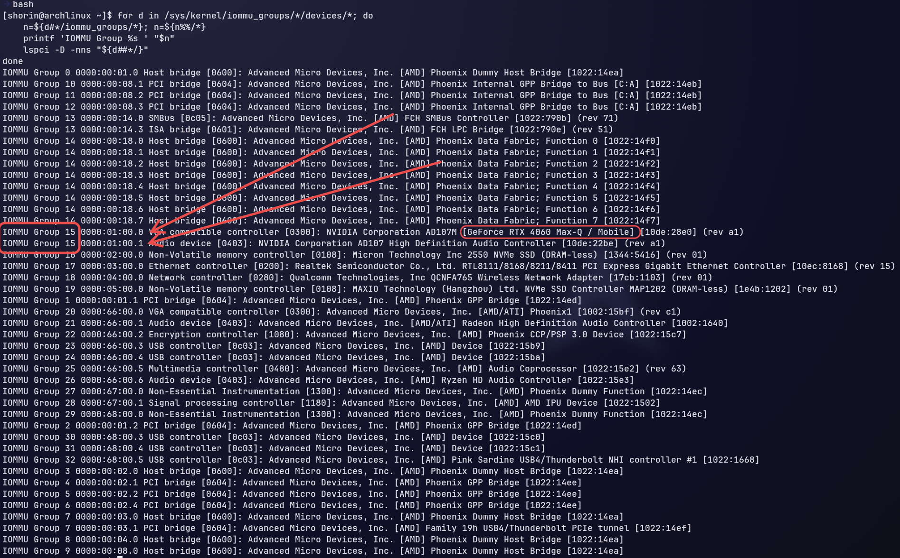
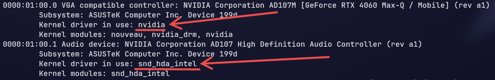

注意，这是我的情况下运行的命令，你要按照自己的实际情况进行修改。

## 开启显卡直通

1. 确保开启混合模式，显示器画面由核显输出。


2. 确定 NVIDIA 的 DRM 文件名

    ```bash
    ls -l /sys/class/drm/card*/device/driver
    ls -l /sys/class/drm/render*/device/driver
    ```

    > `-l` 显示更多信息

    > `drm` 是 Linux 内核的一个子系统，负责显卡的调度。

    示例输出：

    

    在上面这个例子里可以确定 N 卡是 `card0` 和 `renderD129`。

3. 确认 N 卡上的所有进程

    用以下命令确认正在使用 N 卡的进程（此处的 `card0` `renderD129` 应为你实际的 DRM 文件名）。

    ```bash
    sudo fuser -v /dev/nvidia*
    sudo fuser -v /dev/dri/card0
    sudo fuser -v /dev/dri/renderD129
    ```
    > `fuser` 显示正在使用这个文件的进程。

    > `-v` 显示更多信息。

   - 在 Niri 配置文件里忽略 N 卡的 DRM

        如果你是 Niri，即使以核显运行 Niri，也可能在 N 卡的进程中出现一个 niri，需要编辑配置文件让 Niri 忽略 N 卡。

        1. 确认显卡文件的绝对路径

            虽然可以直接使用 `card0` `renderD129` 指定显卡，但是这个东西是动态分配的，重启后可能会变化，我们需要一个不会变的。

            运行这段命令确认 N 卡的 PCI 路径：
            ```bash
            ls -l /dev/dri/by-path/
            ```
            > `/dev/dri/by-path/` 这是物理硬件路径。

            示例输出：
            ```text
            ls -l /dev/dri/by-path/
            lrwxrwxrwx - root 30 3月  17:09  pci-0000:01:00.0-card -> ../card0
            lrwxrwxrwx - root 30 3月  17:09  pci-0000:01:00.0-render -> ../renderD129
            lrwxrwxrwx - root 30 3月  17:09  pci-0000:66:00.0-card -> ../card1
            lrwxrwxrwx - root 30 3月  17:09  pci-0000:66:00.0-render -> ../renderD128
            ```
            > 你可以注意到这些都是指向 DRM 的链接。

            `pci-0000:01:00.0-card`，`pci-0000:01:00.0-render` 这两串对应主板物理插槽的 PCI 地址就是我们需要的东西。加上前面的 `/dev/dri/by-path/` 就是显卡的绝对物理硬件路径。

        2. 编辑 Niri 的配置文件

            ```text
            debug {
                ignore-drm-device "/dev/dri/by-path/pci-0000:01:00.0-card"
                ignore-drm-device "/dev/dri/by-path/pci-0000:01:00.0-render"
            }
            ```

            > 如果配置 ignore 之后显卡还是出现在了 N 卡进程里，可以尝试加上 `render-drm-device` 指定 Niri 使用的 render。

            > `render-drm-device "/dev/dri/by-path/pci-0000:66:00.0-render"`

        3. 重启 Niri


4. 杀死进程（⚠️警告⚠️ 仔细看一下有哪些进程，如果有桌面环境可能需要别的处理）

    ```bash
    sudo fuser -k -9 /dev/nvidia*
    ```

    > `-k` 关闭正在使用这个文件的进程。

    > `-9` 强制终止。

    > `nvidia*` 星号是一个通配符，代表所有前面带 nvidia 字符的文件。

5. 移除 NVIDIA 的所有模块

    ```bash
    sudo rmmod nvidia_drm
    sudo rmmod nvidia_modeset
    sudo rmmod nvidia_uvm
    sudo rmmod nvidia
    ```

6. 解绑驱动

    1. 确认和 N 卡同 IOMMU 组的 PCI 地址

        ```bash
        for d in /sys/kernel/iommu_groups/*/devices/*; do
            n=${d#*/iommu_groups/*}; n=${n%%/*}
            printf 'IOMMU Group %s ' "$n"
            lspci -D -nns "${d##*/}"
        done
        ```
        示例输出：

        
        需要记录和显卡在同一个 `IOMMU Groups` 的设备的这部分 `0000:01:00.0` `0000:01:00.1`。


    2. 查询驱动

        我们未必知道和 N 卡同组的其他东西的驱动是什么，需要查一下：

        ```bash
        lspci -Dk
        ```

        > `-k` 显示内核驱动信息。

        > `-D` 显示 domain。
        示例输出：

        

        `Kernel driver in use` 后面的 `snd_hda_intel` `nvidia` 就是正在使用的驱动。

    3. 从驱动解绑（此处的 `0000:01:00.0` 部分应为你实际的 PCI 地址，`nvidia` `snd_hda_intel` 应为你实际的驱动名）

    ```bash
    # 这里也许会报错，因为前面已经 rmmod nvidia 之后可能已经解绑了。
    echo "0000:01:00.0" | sudo tee /sys/bus/pci/drivers/nvidia/unbind

    # 解绑音频模块驱动
    echo "0000:01:00.1" | sudo tee /sys/bus/pci/drivers/snd_hda_intel/unbind
    ```

    > `tee` 将标准输入复制到文件。使用 `sudo tee` 而不是重定向符 `>` 是因为重定向符由当前 shell 运行，没有 root 权限处理 `/sys` 里的文件。

7. 让 VFIO 接管

    ```bash
    # 加载 VFIO 模块
    sudo modprobe vfio-pci

    # 覆盖驱动为 VFIO
    echo "vfio-pci" | sudo tee /sys/bus/pci/devices/0000:01:00.0/driver_override
    echo "vfio-pci" | sudo tee /sys/bus/pci/devices/0000:01:00.1/driver_override

    # 重新扫描设备绑定 VFIO
    echo "0000:01:00.0" | sudo tee /sys/bus/pci/drivers_probe
    echo "0000:01:00.1" | sudo tee /sys/bus/pci/drivers_probe
    ```

    此时显卡就应该给 VFIO 了，可以用下面这条命令确认：
    ```bash
    lspci -k | grep -A 2 -i nvidia
    ```

## 热切换内存大页

默认的内存大页是 2MB，如果你的内存足够多，可以试试使用 1GB 的大页。

### 2MB

1. 释放缓存，清理内存碎片

    ```bash
    sudo sync
    echo 3 | sudo tee /proc/sys/vm/drop_caches
    echo 1 | sudo tee /proc/sys/vm/compact_memory
    ```

2. 分配内存大页（把 8192 换成你实际需要的大页数量）

    ```bash
    sysctl -w vm.nr_hugepages=8192
    ```

    确认是否成功：
    ```bash
    cat /proc/sys/vm/nr_hugepages
    ```

### 1GB

1. 释放缓存，清理内存碎片

    ```bash
    sync
    echo 3 | sudo tee /proc/sys/vm/drop_caches
    echo 1 | sudo tee /proc/sys/vm/compact_memory
    ```
2. 分配内存大页（把 16 换成你实际需要的大页数量）

    ```bash
    echo 16 | sudo tee /sys/kernel/mm/hugepages/hugepages-1048576kB/nr_hugepages
    ```

    确认是否成功：
    ```bash
    cat /sys/kernel/mm/hugepages/hugepages-1048576kB/nr_hugepages
    ```

3. 修改虚拟机 XML

    2MB 的时候写的是 `<hugepages>`，1GB 的话要加上 `<page size="1048576" unit="KiB"/>`。

   ```xml
    <memoryBacking>
        <hugepages>
            <page size="1048576" unit="KiB"/>
        </hugepages>
    </memoryBacking>
   ```

## 关闭显卡直通

关闭比开启简单得多。

1. 确认显卡直通虚拟机已经关闭

    一定要关，不然可能会卡死。

2. 解绑 VFIO

    ```bash
    # 移除驱动覆盖
    echo "" | sudo tee /sys/bus/pci/devices/0000:01:00.0/driver_override
    echo "" | sudo tee /sys/bus/pci/devices/0000:01:00.1/driver_override

    # 解绑 VFIO
    echo "0000:01:00.0" | sudo tee /sys/bus/pci/drivers/vfio-pci/unbind
    echo "0000:01:00.1" | sudo tee /sys/bus/pci/drivers/vfio-pci/unbind
    ```

3. 重新加载 NVIDIA 模块

    ```bash
    sudo modprobe nvidia
    sudo modprobe nvidia_drm
    sudo modprobe nvidia_modeset
    sudo modprobe nvidia_uvm
    ```
4. 重新检测，激活显卡

    ```bash
    echo "0000:01:00.0" | sudo tee /sys/bus/pci/drivers_probe
    echo "0000:01:00.1" | sudo tee /sys/bus/pci/drivers_probe
    ```

5. 释放内存大页

   - 2MB

        ```bash
        sysctl -w vm.nr_hugepages=0
        ```
        确认：

        ```bash
        cat /proc/sys/vm/nr_hugepages
        ```
   - 1GB

        ```bash
        echo 0 | sudo tee /sys/kernel/mm/hugepages/hugepages-1048576kB/nr_hugepages
        ```
        确认：
        ```bash
        cat /sys/kernel/mm/hugepages/hugepages-1048576kB/nr_hugepages
        ```
